<p align="center">
 
 <h1 align="center">ZYNQ</h2>
 <p align="center">Based on XC7Z020clg400-2 Soc</p>
</p>

<div align=center>
[](LICENSE)
[]
[]


<div align=left>

[toc]


## FPGA

---待补充---

## 嵌入式设计SDK

---待补充---

## PetaLinux

### 从SD启动Linux

实验说明：从 SD 卡中启动 Linux，只使用 PS 端

实验顺序：

#### 硬件设计及获取 .hdf 文件

1. 在 Vivado 创建工程，关闭不需要的端口，并且将 SD卡、JTAG、网口打开

   只有打开了网口，之后才能进行网络连接和通信！

   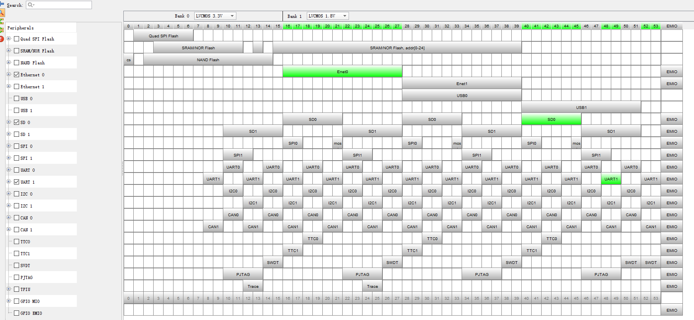

2. 为了获取更快的速度，**在 MIO Configuration 菜单中将 SD 卡和网口的所有端口的速度设置为 `fast`**

3. 修改内存及 Bank1 的电压

4. 得到以下

   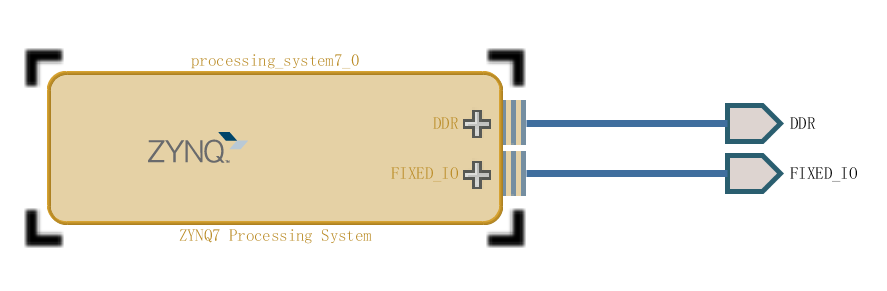

5. 导出顶层 HDL，及硬件

6. 启动 SDK

   **注意：启动 SDK 的目的是为了获取到 system.hdf 这一硬件描述文件，是为了之后使用 petalinux 创建工程而使用**

7. 在 工程下的 SDK 文件夹中，得到 `.hdf` 文件，并将其拷贝到 Linux 环境下


#### 使用 PetaLinux 创建引导

1. 新建 PetaLinux 工程

   ```bash
   petalinux-create --type project --template zynq --name 【想创建的工程的名字】
   ```


2. **进入工程目录**，将之前在 SDK 中获取到的 `system.hdf` 硬件描述文件拷贝至工程根目录

   `system.hdf` 用其配置工程

   ```bash
   petalinux-config --get-hw-description=.			# 最后的 `.` 代表 .hdf 文件在当前工程目录下
   
   # 技巧：获取这个命令可以通过使用 patelinux-config --help
   # 如果 hdf 文件在其他目录，或者使用了整个 sdk 文件夹，可以使用
   petalinux-config --get-hw-description 【sdk文件夹目录】
   # 进行配置导入
   ```

   此工程将直接使用默认配置，所以直接退出配置界面即可

   

3. 编译工程

   ```bash
   petalinux-build
   ```

   命令执行完会生成 `image` 文件夹，里面包含了 U-BOOT 等之后我们需要用到的文件

   - 需要用到的文件：u-boot.elf 、zynq_fsbl.elf 、image.ub，他们会用来生成 BOOT.bin 

   - **zynq_fsbl.elf**

     当嵌入式系统启动时， ARM 将执行 PS 域上 ROM 中的程序，将非易失性存储如 Flash， SD卡上的 first stage boot loader 文件加载到 DDR 并执行，first stage boot loader 主要完成以下功能

     1. 使用FPGA 比特流文件配置FPGA（如果存在比特流，本例没有）
     2. 配置PS 域的MIO 端口
     3. 初始化DDR 控制器
     4. 初始化系统时钟， PLL
     5. 将 u-boot 从非易失存储如 Flash， SD 卡等load 到DDR 中

   - **u-boot.elf**

     嵌入式系统通用 Boot 文件，负责将 image.ub 从非易失存储如 Flash，SD 卡等 load 到DDR 中

   - **image.ub**

     PetaLinux，包括内核镜像、ramdisk、设备树dtb

     

4. 格式化 U盘，并设置分区

   ```bash
   # 切换为管理员
   su
   
   # 查看系统磁盘设备信息，并找到待U盘的目录(Linux系统中所有设备均被视为文件)
   fdisk -l		# 示例中为 /dev/sdb1
   
   # 注意：进行下面的操作时必须取消挂载
   # 开始使用 fdisk 进行和分区
   fdisk /dev/sdb
   > p				# 查看分区
   > d				# 删除分区
   > p				# 查看是否删除成功
   > n				# 增加主分区
   > p				# 设置为主分区
   > 一直默认回车，如果是想增加特定大小（比如增加100M），就在第2个提示处使用 +100M
   > t				# 改变分区类型
   > c				# 设置为W95 FAT32 (LBA)，如果是Linux分区就输入83
   >q				# 退出
   
   # 格式化
   # 注意：mkfs 后面不是固定的！要根据分区类型而改变！！！
   mkfs.vfat -F 32 -n boot /dev/sdb1	# 格式化 FAT32 类型的分区，并设置为 boot
   mkfs.ext4 -L rootfs -n /dev/sdb2	# 格式化 ext4 类型的分区，并设置为 rootfs
   ```

   

5. 制作 BOOT.bin

   1. 【使用 Windows 制作】复制文件到 windows 下，准备制作 BOOT.bin 

      需要用到的文件：u-boot.elf 、zynq_fsbl.elf 、image.ub，他们会用来生成 BOOT.bin 

      为了方便管理，在 vivado 工程目录下新建一个 images 文件夹，并把上述的 3 个文件拷贝进去

      下面开始制作 Boot.bin 文件

      - 选择 Create Boot Image

      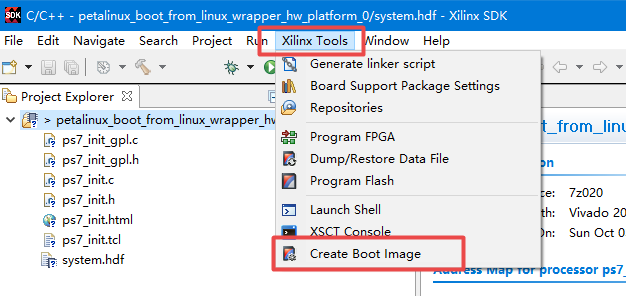

      - 选择输出路径

      - 建议使用刚刚创建的 images文件夹

        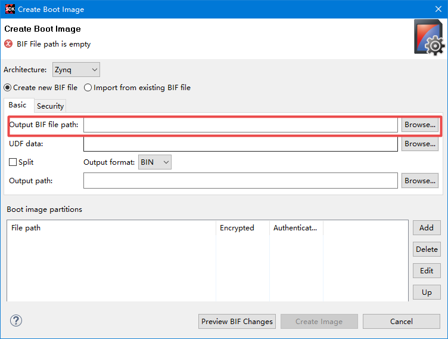

      - 添加 bootloader，也就是 zynq_fsbl.elf
      
        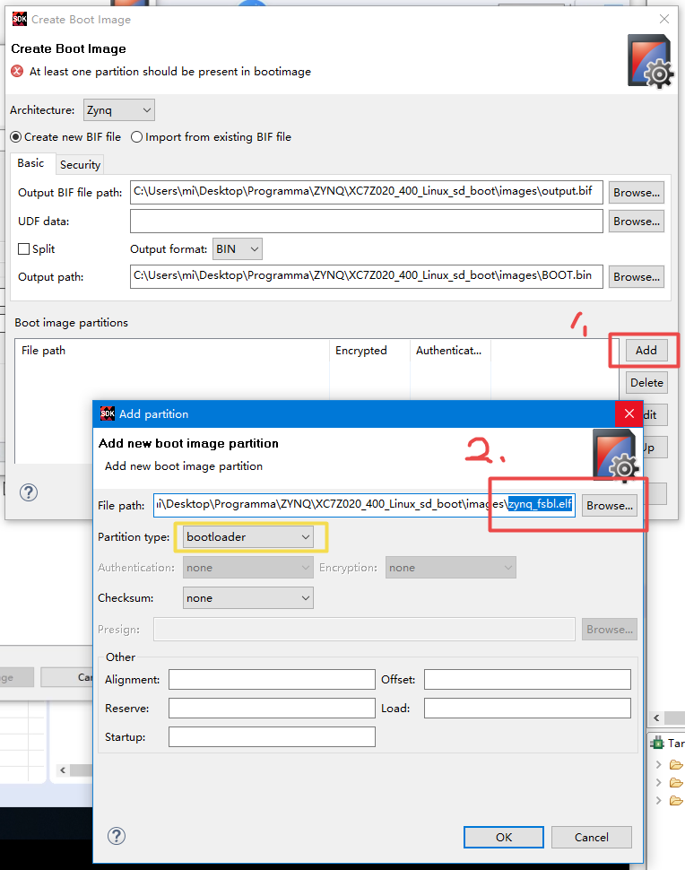
      
      - 添加 datafile，也就是 u-boot.elf
      
        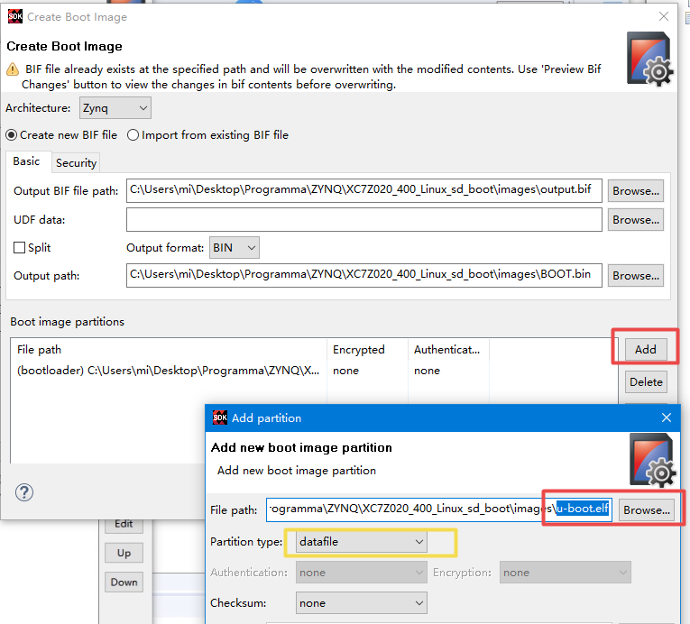
      
      - 点击 Create Image 打包生成 BOOT.bin 文件
      
        
      
   2. **【使用 Ubuntu 制作】使用 PeataLinux 打包**

      ```bash
      # 用到了哪些参数，才写哪些参数
      patalinux-package --boot --fsbl --fpga --u-boot --force
      ```

      

6. 将 Boot.bin 和 image.ub 拷贝至 SD 卡中

7. 开发板设置为 SD 模式，启动

8. 使用 MobaXterm 进行连接，当然用 Putty 也可以。

   **默认的登录名和密码都是 root**

   成功启动并登录：

   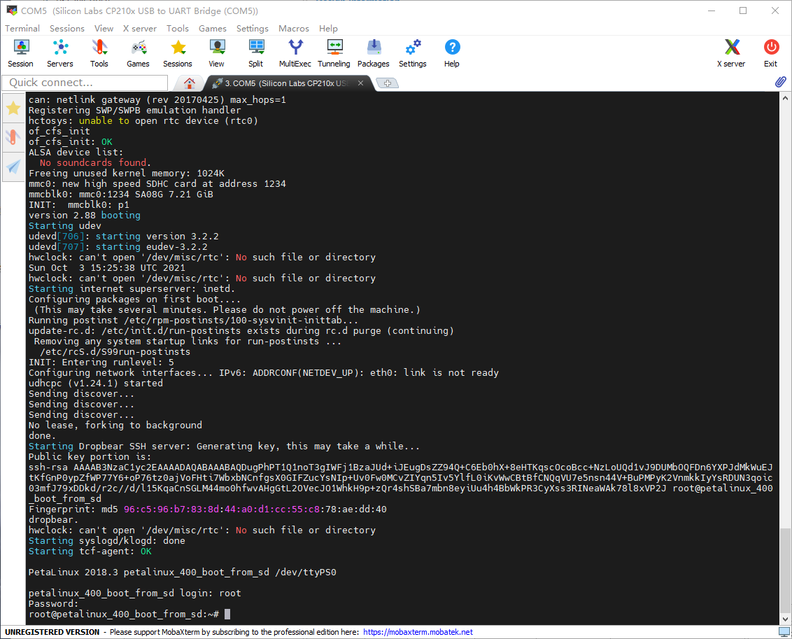

#### 驱动 USB 外设

1. 根据开发板原理图，开启 USB 对应的端口，**并打开 GPIO MIO，设置 USB 的 Reset 端口！**

   可以根据选择，将 USB 的速度设置为 fast

   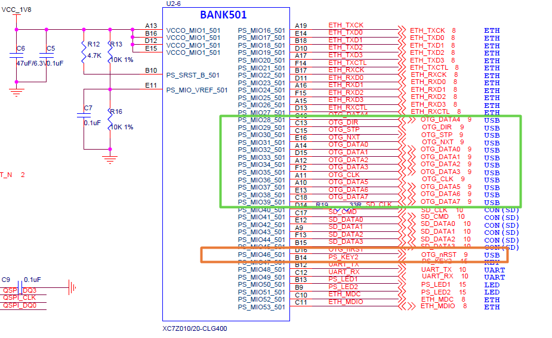

   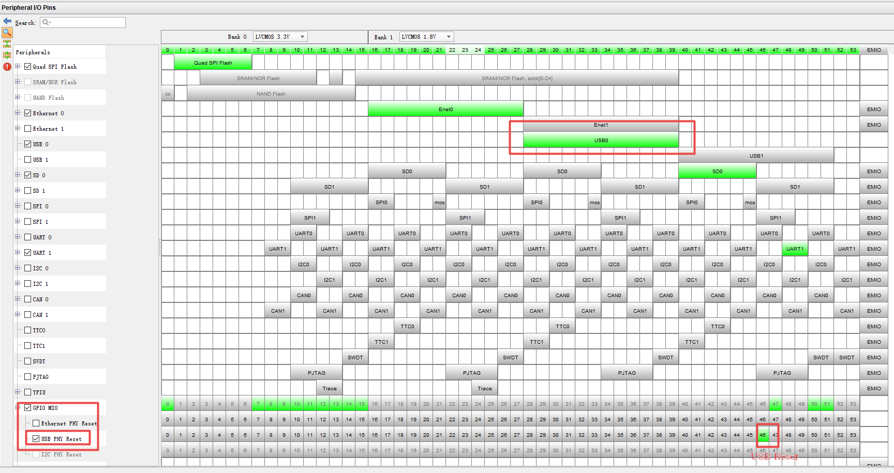

2. 其他地方同上一实验保持一致，导出硬件设计，打开SDK，得到 `.hdf` 硬件描述文件

3. 使用 PetaLinux 创建并配置工程，这两步同样保持默认配置

4. 配置 USB

   1. 为了支持USB 外设，这里要配置Kernel ，从Xilinx 官方Wiki http://www.wiki.xilinx.com/Zynq+Linux+USB+Device+Driver 可知，USB 设备有三种配置， 即HOST 模式，Peripheral 模式和OTG 模式，各模式的配置如下：

      - HOST 模式

        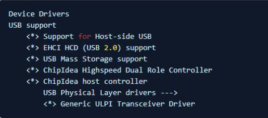

      - Peripheral Mode

        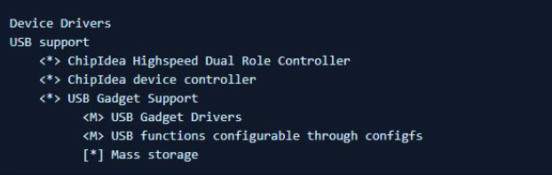

      - OTG

        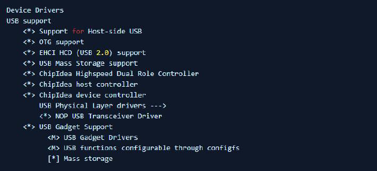

      使用以下命令入**kernal 配置界面：**

      ```bash
      petalinux-config –c kernal
      ```

      按需要，将 USB 配置成所需的模式，保存退出

5. **修改设备树**

   **为支持 USB 设备的使用**，我们需要在设备树文件中添加关于USB 的相关内容， 打开目录`~工作目录/project-spec/meta-user/recipes-bsp/device-tree/files` 下的 **`system-user.dtsi`** 文件，并在其中添加以下内容并保存。

   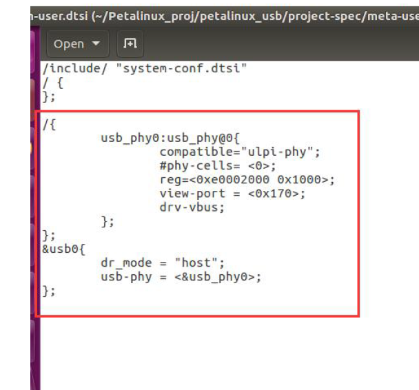

6. 编译工程，得到 zynq_fsbl.elf， u-boot.elf 和image.ub

   ```bash
   petalinux-build
   ```

7. 打包（参考上个任务）

8. 开发板验证

### 编写Linux应用程序

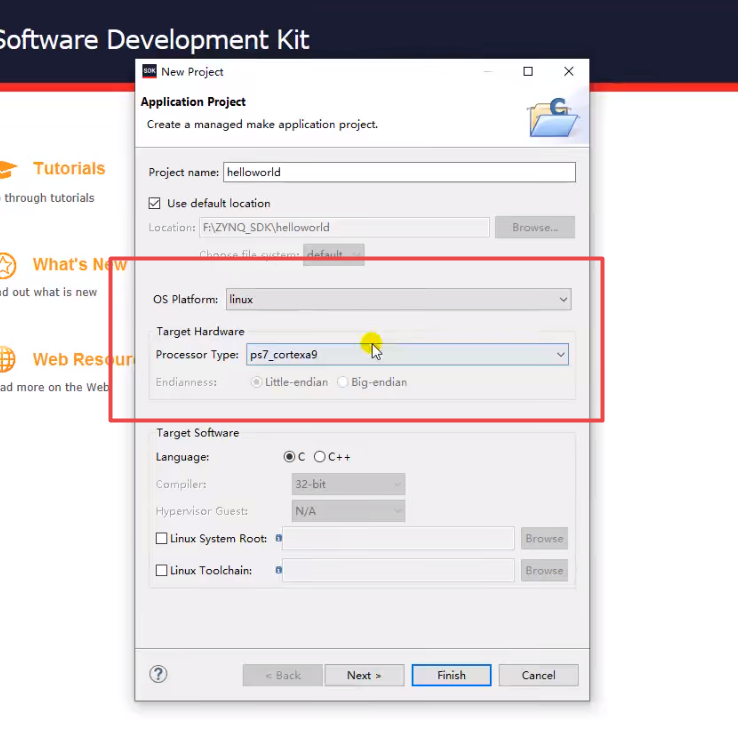

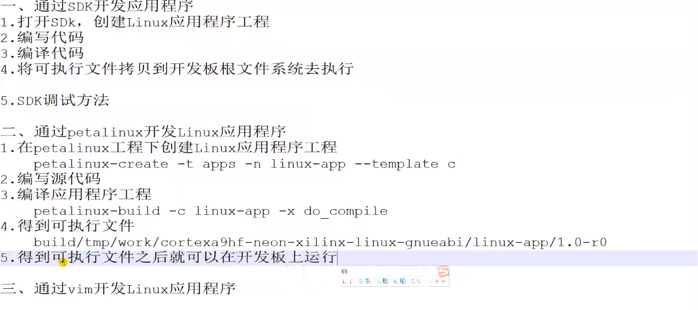

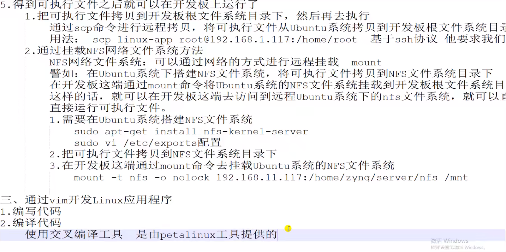

**使用交叉编译工具，由 PetaLinux提供**

```bash
arm-linux-gnueabinf-gcc -o 输出文件名 main.c
```


---


#### 用户自定义IP（LCD）屏幕上运行 Linux

任务说明：

本实验使用了用户自定义IP核（LCD屏幕），并在Vivado进行硬件设计之后通过 PetaLinux 工具编译、配置、打包以获得`BOOT.bin` 和 `image.ug` 文件，最终实现开发板运行定制的 Linux 操作系统并驱动LCD屏幕显示。

---

硬件平台：

- Board：Mizar Z7
- SoC：Zynq-7 XC7Z020clg400-2
- LCD：MLCD-43D_R10
- SD：SanDisk 8Gb TF

软件平台：

- Ubuntu 16.04 x64
- Vivado v2018.3
- SDK v2018.3
- PetaLinux v2018.3
- Kernel：Linux-4.14

---

分为以下三大部分：

- Vivado 硬件设计部分（获取 `system.hdf` 硬件描述文件）
- PetaLinux 配置（获取`BOOT.bin` 和 `image.ug` 镜像文件）
- 开发板验证

#### Vivado 设计部分（所需IP的导入及hdf硬件描述文件的获取）

1. 新建 Vivado 工程，这里不再赘述

2. 导入自定义IP核【具体创建的过程稍后补充】

   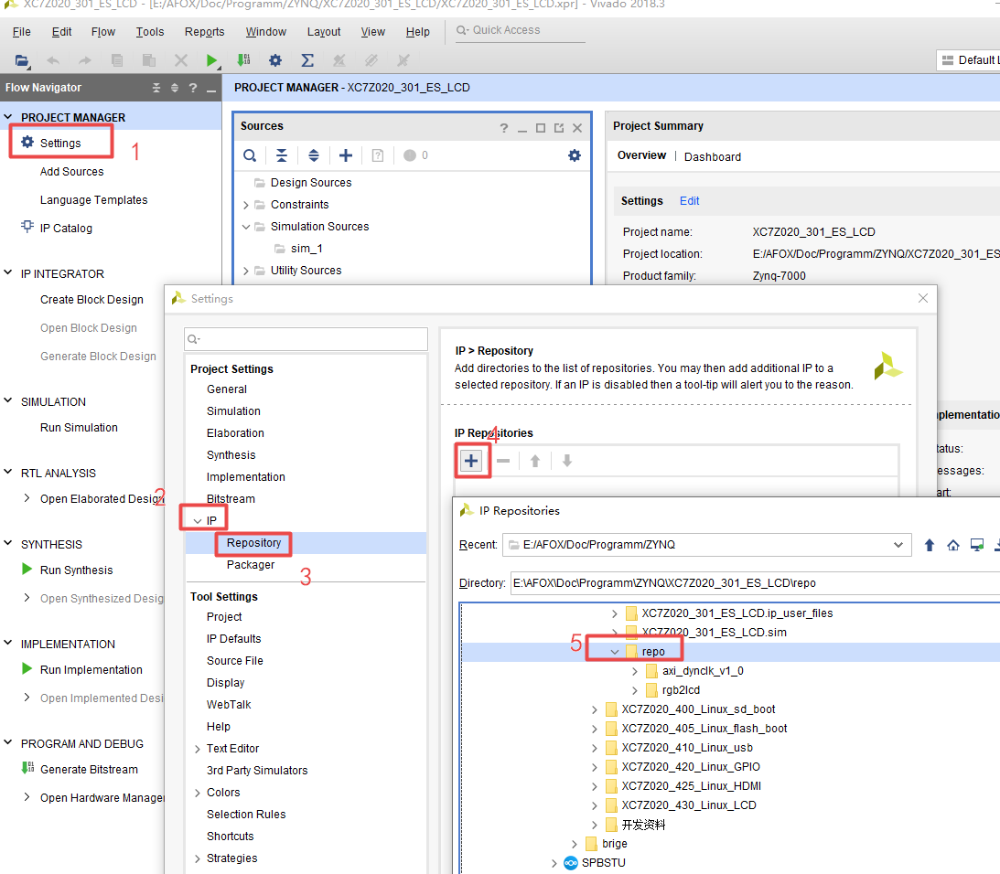

   可以看到Vivado自动识别了我们创建的IP核

   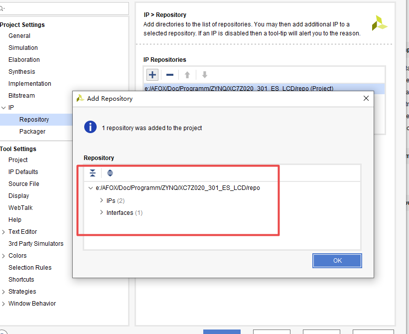

3. 导入 Zynq7 IP核并配置

   因为我们之后会使用 Flash、网络、USB、SD卡、串口通信；所以按照开发板的原理图，我们将各个端口做以下设置

   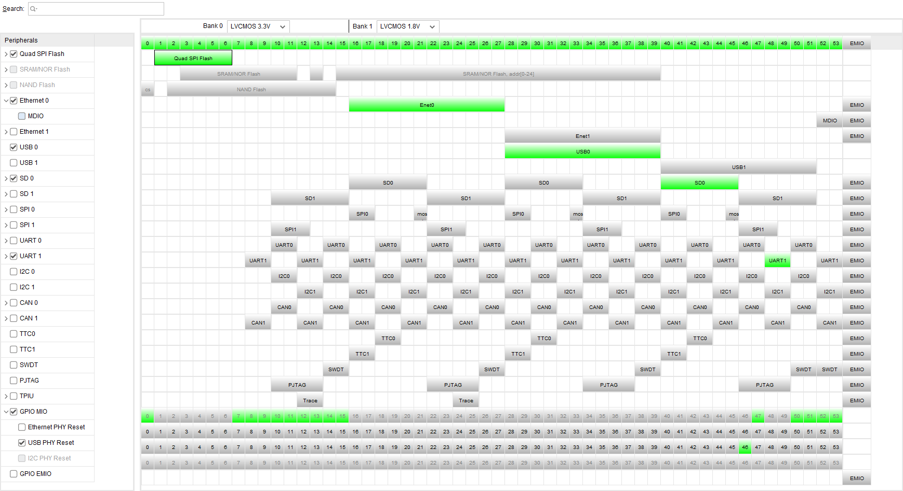

   使能 S_AXI_HP0 

   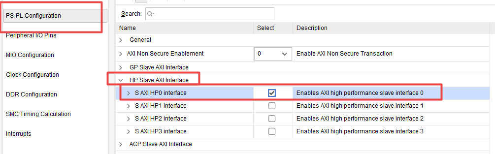

   为了适配 LCD 屏幕，我们将PL的输出频率设置为100

   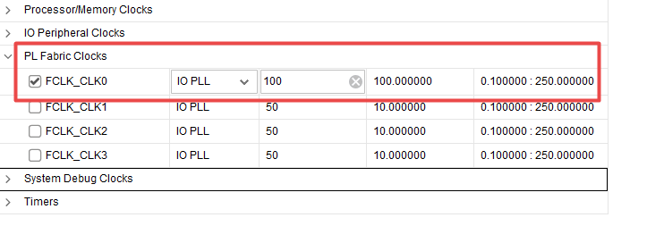

   点击 Interrupt，使能 PL 到 PS 端的中断输入端口

   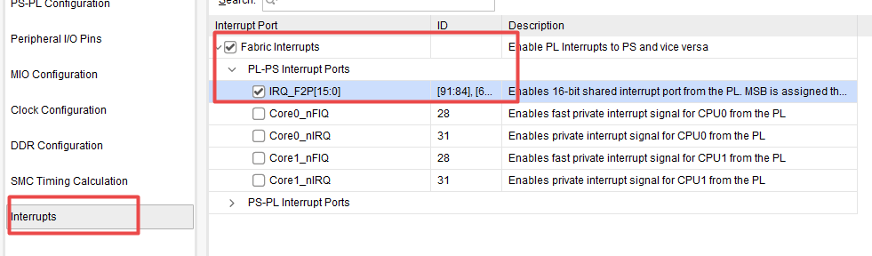

   配置完成后，得到如下所示

   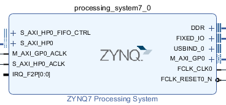

4. 导入 VDMA IP

   > 使用 VDMA IP 核来实现对于 AXI4-Stream 类目标外设的高带宽直接存储器存取来读取 DDR 中的数据。VDMA 读取到数据之后通过 AXI4-Stream to Video Out IP 核将数据流转换成视频协议的数据流，之后在将该数据流转换为符合 RGB LCD 接口的时序就可以在 LCD 屏幕上显示了。

   `Frame Buffers` 选项可以选择 AXI VDMA 要处理的帧缓冲存储位置 的数量。由于本次显示实验只显示一张图片，数据只需要写入一次，因此不需要 设置多个帧缓存区域，这里设置为 1。因为本实验是从 DDR3 中读取数据输出给 LCD，所以只需要勾选 Enable Read Channel 就可以了，无需勾选 Enable Write Channel。

   `Memory Map Data Width` 选项可以为 MM2S 通道选择所需的 AXI4 数据宽度。此处保持默认 64 即可

   `Read Burst Size` 用于指定突发读的大小，此处选择 64

   `Stream Data Width` 选 项可以选择 MM2S 通道的 AXI4-Stream 数据宽度。 有效值是 8 的倍数，最大 到 1024。 必须注意的是该值必须小于或等于 Memory Map Data Width。**此处因输出数据格式为 RGB888，设置为 24**

   `Line Buffer Depth` 选项可以选择 MM2S 通道的行缓冲深度（行缓冲区宽度 为 stream data 的大小） ，此处设置 **2048**

   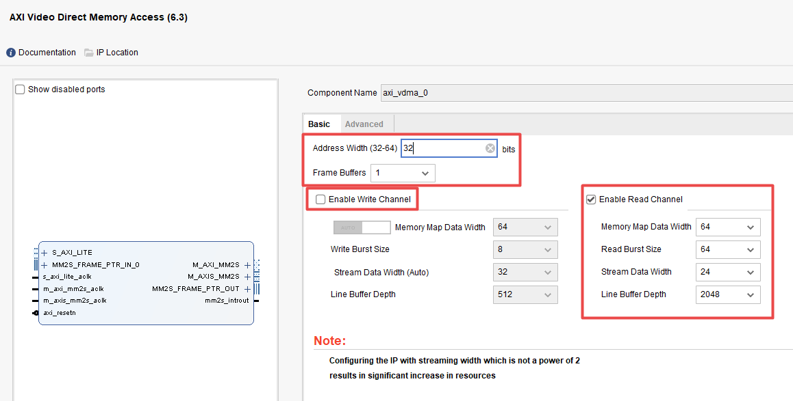

5. 导入 Timing IP核 （视频时序控制器）

   配置如下

   

   

6. 导入 video out（视频输出控制器）

   这里我们使用了独立时钟作为输入，所以选择独立时钟

   

7. **导入自定义LCD IP**

    `Reddepth`、` Greendepth` 和 `Buledepth` 用于 设置输出的 Red、Green 和 Blue 颜色的位数，这里我们使用 RGB888，所以分别设置为 8、8、8

   `Vid In Data Width` 用于指定输入的 RGB 总线宽度，为 24 位

   `Vid Out Data Width` 用于指定输出的 RGB 总线宽度，为 24 位

   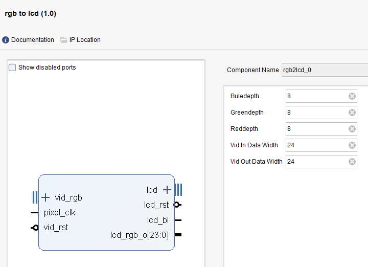

8. 导入dynamic 动态时钟控制器 IP

   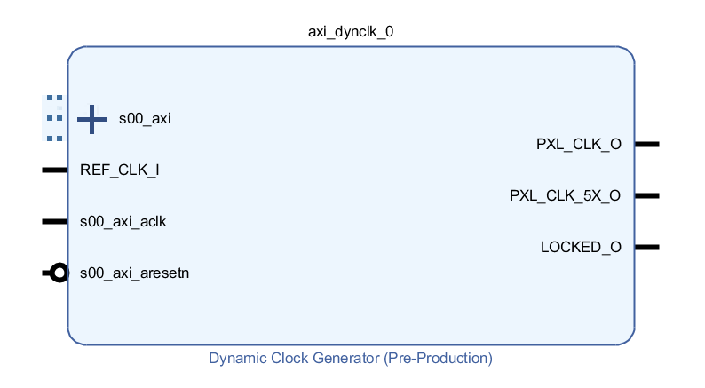

9. 因为 Vivado 自动连接会导致错误，所以我们这里手动分配时钟信号如下

   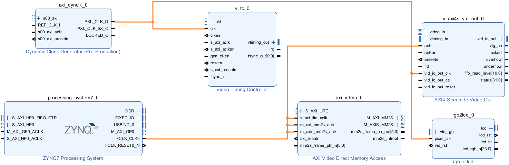

10. 使用 Vivado自动导出 Zynq7 PS IP核 的引脚

    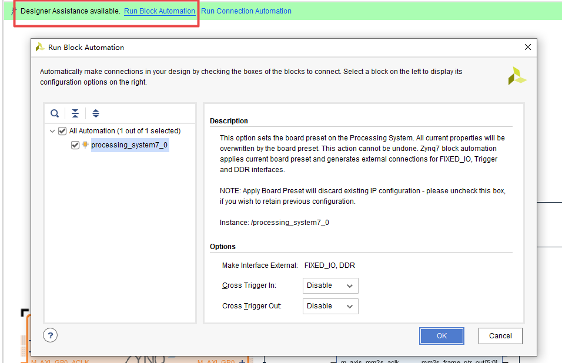

11. 手动引出 自定义 IP 的相关引脚

     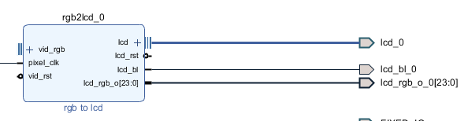

12. 让 Vivado 自动帮我们连接相关引脚

     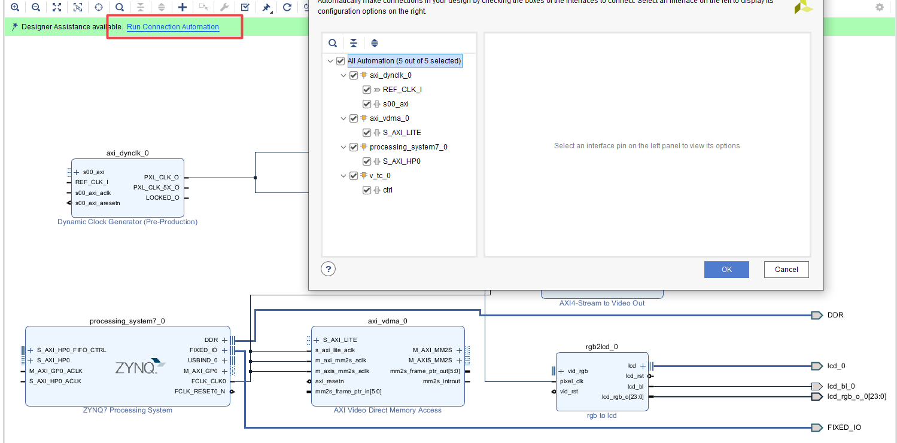

13. 连接完成后部分信号无法自动连接，需手动连接

     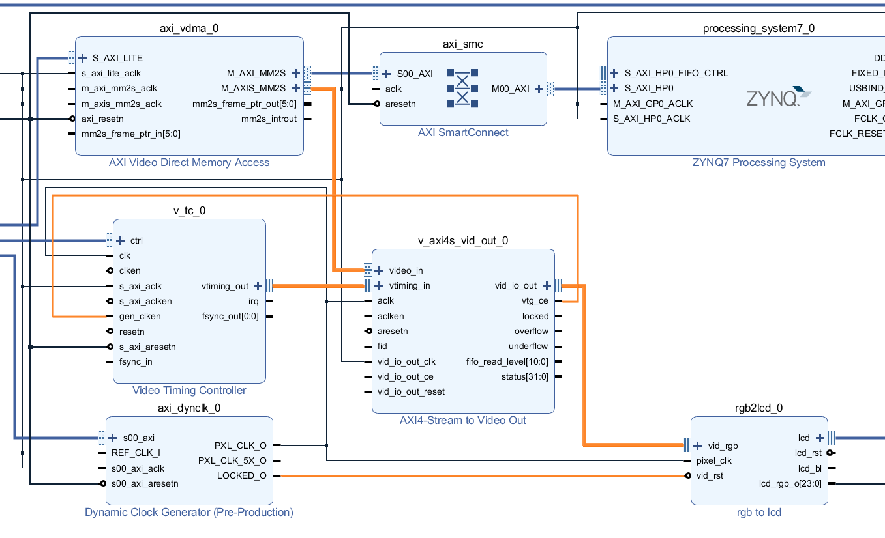

14. 得到以下设计

     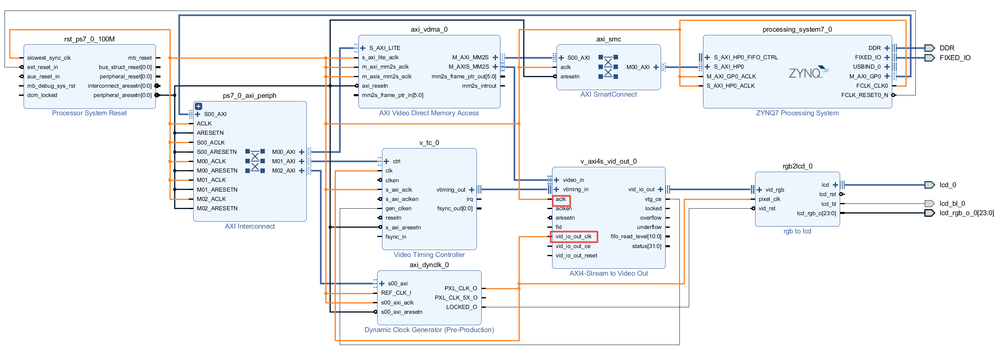

15. 导入 Concat IP核，以连接中断信号

     连接 VDMA 的 mm2s_introut 中断信号和 Video Timing Controller 的 irq 中断信号到 concat IP 的输入端，连接 Concat 的输出端到 ZYNQ7 Processing System 的中断信号输入端

     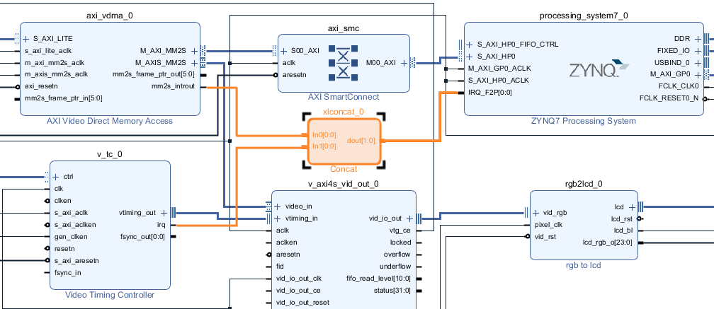

16. 最终得到以下设计

     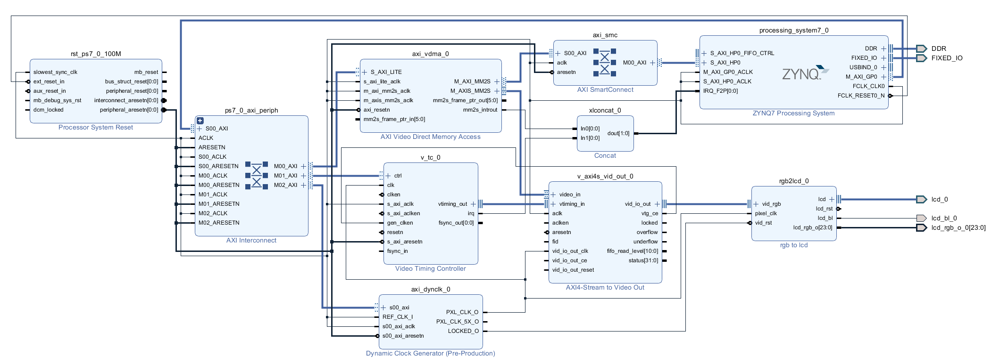

17. 生成顶层 HDL 文件

     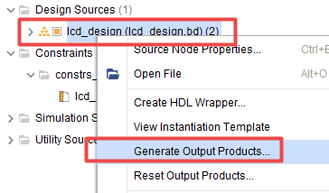

     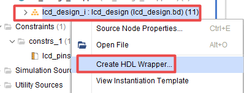

18. 使用了GPIO0，所以我们根据开发板和LCD屏幕的原理图进行引脚约束

     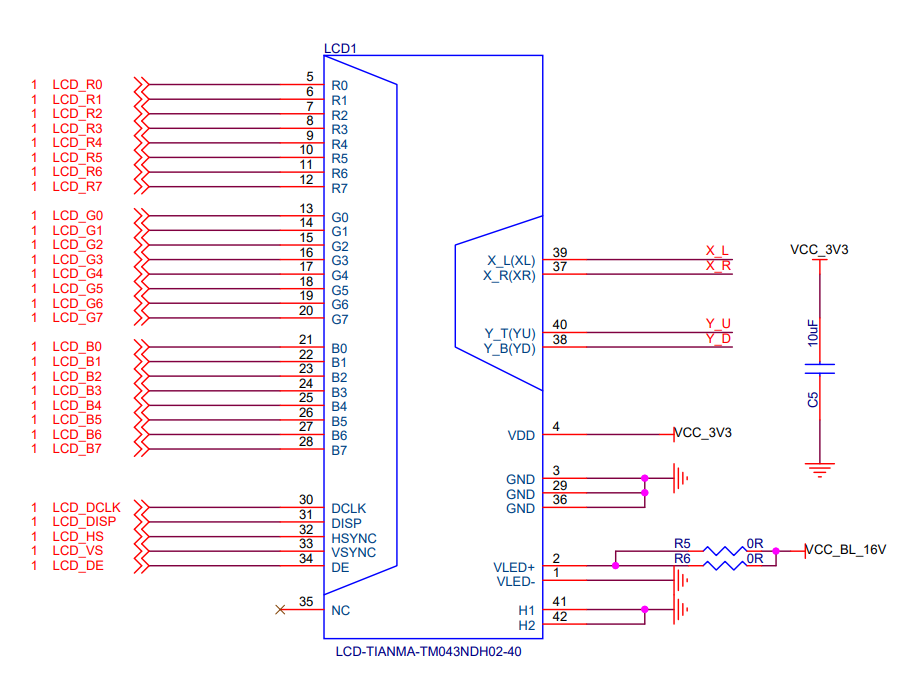

     ```xdc
     set_property IOSTANDARD LVCMOS33 [get_ports lcd_lcd_hs]
     set_property IOSTANDARD LVCMOS33 [get_ports lcd_lcd_vs]
     set_property IOSTANDARD LVCMOS33 [get_ports lcd_lcd_de]
     set_property IOSTANDARD LVCMOS33 [get_ports lcd_lcd_pclk]
     set_property IOSTANDARD LVCMOS33 [get_ports lcd_bl0]
     set_property IOSTANDARD LVCMOS33 [get_ports {lcd_rgb_o[23]}]
     set_property IOSTANDARD LVCMOS33 [get_ports {lcd_rgb_o[22]}]
     set_property IOSTANDARD LVCMOS33 [get_ports {lcd_rgb_o[21]}]
     set_property IOSTANDARD LVCMOS33 [get_ports {lcd_rgb_o[20]}]
     set_property IOSTANDARD LVCMOS33 [get_ports {lcd_rgb_o[19]}]
     set_property IOSTANDARD LVCMOS33 [get_ports {lcd_rgb_o[18]}]
     set_property IOSTANDARD LVCMOS33 [get_ports {lcd_rgb_o[17]}]
     set_property IOSTANDARD LVCMOS33 [get_ports {lcd_rgb_o[16]}]
     set_property IOSTANDARD LVCMOS33 [get_ports {lcd_rgb_o[15]}]
     set_property IOSTANDARD LVCMOS33 [get_ports {lcd_rgb_o[14]}]
     set_property IOSTANDARD LVCMOS33 [get_ports {lcd_rgb_o[13]}]
     set_property IOSTANDARD LVCMOS33 [get_ports {lcd_rgb_o[12]}]
     set_property IOSTANDARD LVCMOS33 [get_ports {lcd_rgb_o[11]}]
     set_property IOSTANDARD LVCMOS33 [get_ports {lcd_rgb_o[10]}]
     set_property IOSTANDARD LVCMOS33 [get_ports {lcd_rgb_o[9]}]
     set_property IOSTANDARD LVCMOS33 [get_ports {lcd_rgb_o[8]}]
     set_property IOSTANDARD LVCMOS33 [get_ports {lcd_rgb_o[7]}]
     set_property IOSTANDARD LVCMOS33 [get_ports {lcd_rgb_o[6]}]
     set_property IOSTANDARD LVCMOS33 [get_ports {lcd_rgb_o[5]}]
     set_property IOSTANDARD LVCMOS33 [get_ports {lcd_rgb_o[4]}]
     set_property IOSTANDARD LVCMOS33 [get_ports {lcd_rgb_o[3]}]
     set_property IOSTANDARD LVCMOS33 [get_ports {lcd_rgb_o[2]}]
     set_property IOSTANDARD LVCMOS33 [get_ports {lcd_rgb_o[1]}]
     set_property IOSTANDARD LVCMOS33 [get_ports {lcd_rgb_o[0]}]
     set_property PACKAGE_PIN V13 [get_ports lcd_lcd_de]
     set_property PACKAGE_PIN U15 [get_ports lcd_lcd_hs]
     set_property PACKAGE_PIN Y14 [get_ports lcd_lcd_pclk]
     set_property PACKAGE_PIN U14 [get_ports lcd_lcd_vs]
     set_property PACKAGE_PIN W14 [get_ports lcd_bl0]
     set_property PACKAGE_PIN W19 [get_ports {lcd_rgb_o[0]}]
     set_property PACKAGE_PIN W18 [get_ports {lcd_rgb_o[1]}]
     set_property PACKAGE_PIN U19 [get_ports {lcd_rgb_o[2]}]
     set_property PACKAGE_PIN U18 [get_ports {lcd_rgb_o[3]}]
     set_property PACKAGE_PIN W16 [get_ports {lcd_rgb_o[4]}]
     set_property PACKAGE_PIN V16 [get_ports {lcd_rgb_o[5]}]
     set_property PACKAGE_PIN W15 [get_ports {lcd_rgb_o[6]}]
     set_property PACKAGE_PIN V15 [get_ports {lcd_rgb_o[7]}]
     set_property PACKAGE_PIN P19 [get_ports {lcd_rgb_o[8]}]
     set_property PACKAGE_PIN W20 [get_ports {lcd_rgb_o[9]}]
     set_property PACKAGE_PIN V20 [get_ports {lcd_rgb_o[10]}]
     set_property PACKAGE_PIN Y19 [get_ports {lcd_rgb_o[11]}]
     set_property PACKAGE_PIN N18 [get_ports {lcd_rgb_o[12]}]
     set_property PACKAGE_PIN Y18 [get_ports {lcd_rgb_o[13]}]
     set_property PACKAGE_PIN Y17 [get_ports {lcd_rgb_o[14]}]
     set_property PACKAGE_PIN Y16 [get_ports {lcd_rgb_o[15]}]
     set_property PACKAGE_PIN U20 [get_ports {lcd_rgb_o[16]}]
     set_property PACKAGE_PIN T20 [get_ports {lcd_rgb_o[17]}]
     set_property PACKAGE_PIN R18 [get_ports {lcd_rgb_o[18]}]
     set_property PACKAGE_PIN T17 [get_ports {lcd_rgb_o[19]}]
     set_property PACKAGE_PIN P20 [get_ports {lcd_rgb_o[20]}]
     set_property PACKAGE_PIN N20 [get_ports {lcd_rgb_o[21]}]
     set_property PACKAGE_PIN P18 [get_ports {lcd_rgb_o[22]}]
     set_property PACKAGE_PIN N17 [get_ports {lcd_rgb_o[23]}]
     ```

     

19. 因为我们使用到了PL端的资源，所以我们需要生成比特流文件

     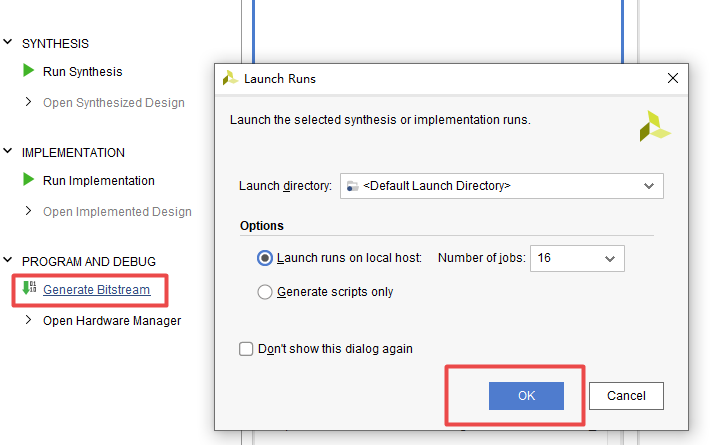

20. Vivado提示有错误无法生成比特流；经过查看，错误为我们自定义的LCD屏幕IP的端口名称与XDC文件中的不匹配，所以我们进行修改

     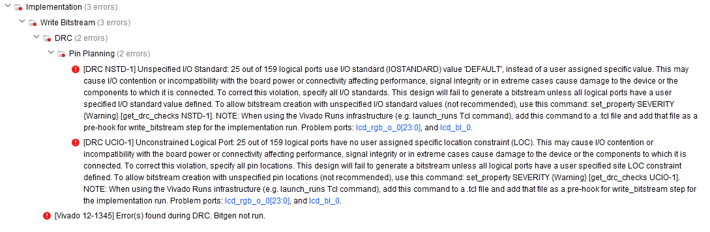

     重命名端口：

     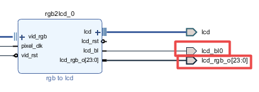

21. 重新生成比特流，成功（MLGB，这破bug找了4天）

     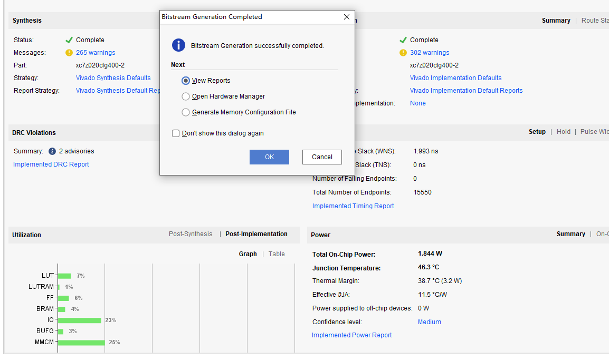

22. 导出到硬件

     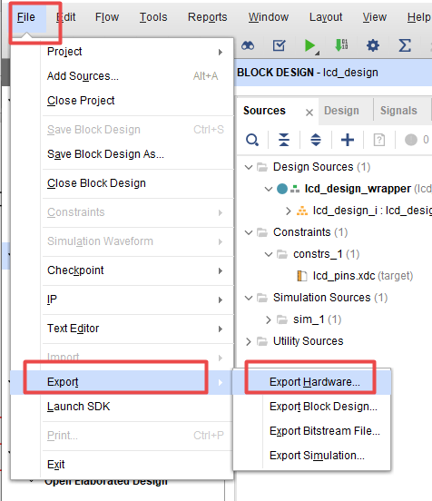

     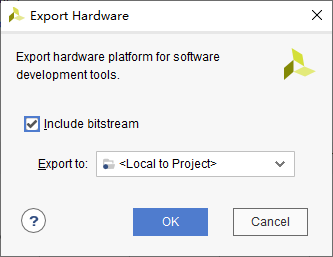

23. 启动 SDK

24. 成功得到了我们需要用到的硬件描述文件 `system.hdf`

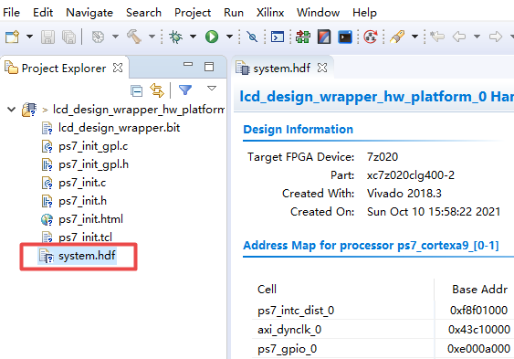

#### 使用 PetaLinux 生成镜像文件

1. 启动 PetaLinux 工具

   ```shell
   source ./petalinux/settings.sh
   ```

   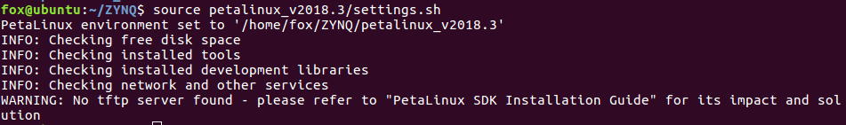

2. 创建工程

   ```shell
   petalinux-create --type project --template zynq --name petalinux_431_lab
   ```

   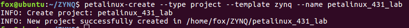

3. 进入工程，并使用 WinSCP 工具将我们获取的硬件描述文件导入当前工程目录

   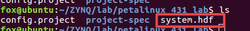

4. 配置工程

   ```shell
   petalinux_config –get-hw-description=.
   ```

   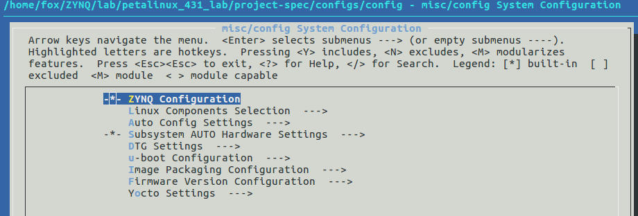

5. 将内核修为本地内核

   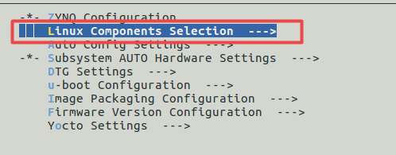

   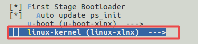

   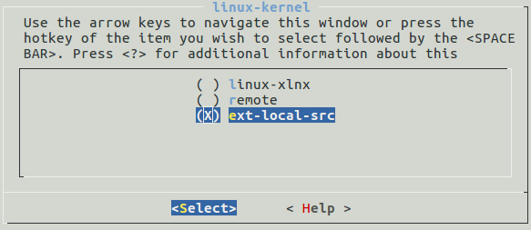

   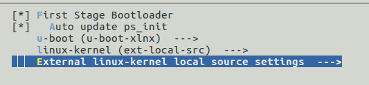

   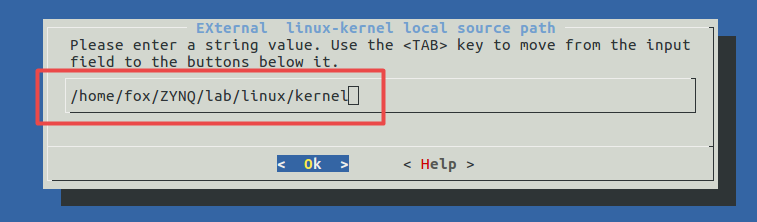

   之后保存退出

   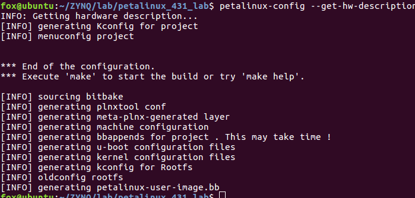

6. 配置内核

   ```shell
   petalinux-config –c kernel
   ```

   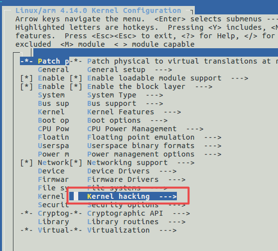

   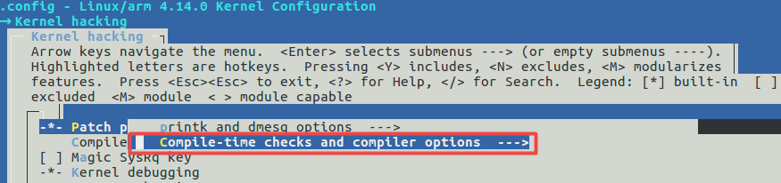

   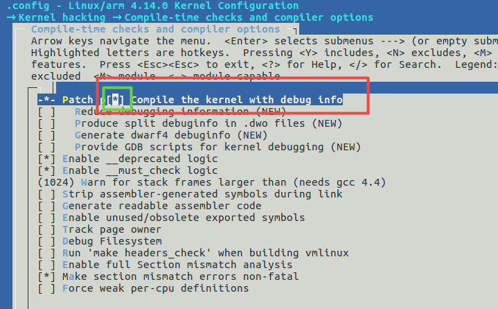

   保存退出

   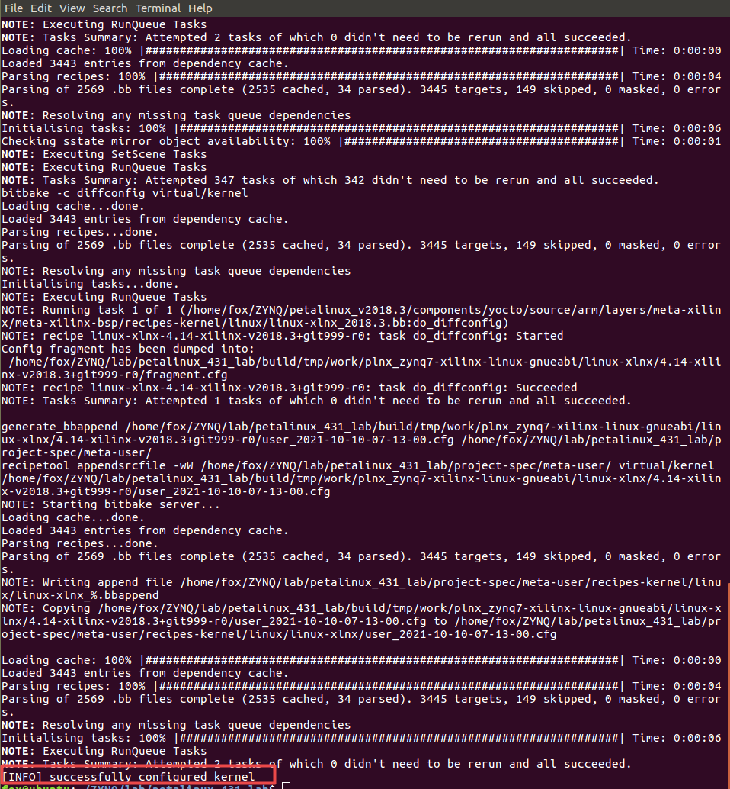

7. 添加（修改）设备树

   ```shell
   vim project-spec/meta-user/recipes-bsp/device-tree/files/system-user.dtsi
   ```

   ```c
   /include/ "system-conf.dtsi"
   
   #define GPIO_ACTIVE_HIGH 0
   #define GPIO_ACTIVE_LOW  1
   
   / {  
       model = "Mizar Development Board"; 
       compatible = "microphase,zynq-7010","xlnx,zynq-7000"; 
   
   	usb_phy0:usb_phy@0{
   		compatible = "ulpi-phy";
   		#phy-cells = <0>;
   		reg = <0xe0002000 0x1000>;
   		view-port = <0x170>;
   		drv-vbus;
   	};
   
       video_timings {
               timing_4x3_480x272: timing0 {
                   clock-frequency = <9000000>;
                   hactive = <480>;
                   vactive = <272>;
       
                   hback-porch = <40>;
                   hsync-len = <20>;
                   hfront-porch = <5>;
                   vback-porch = <8>;
                   vsync-len = <3>;
                   vfront-porch = <8>;
       
                   hsync-active = <0>;
                   vsync-active = <0>;
                   de-active = <1>;
                   pixelclk-active = <0>;
               };
   
               timing_1920x1080: timing1 {
                       clock-frequency = <148500000>;
                       hactive = <1920>;
                       vactive = <1080>;
   
                       hback-porch = <148>;
                       hsync-len = <44>;
                       hfront-porch = <88>;
                       vback-porch = <36>;
                       vsync-len = <5>;
                       vfront-porch = <4>;
   
                       hsync-active = <0>;
                       vsync-active = <0>;
                       de-active = <1>;
                       pixelclk-active = <1>;
               };
       };       
   };
   
   &usb0{
   	dr_mode = "host";
   	usb-phy = <&usb_phy0>;
   };
   &axi_dynclk_0 {
       compatible = "digilent,axi-dynclk";
       clocks = <&clkc 15>;
       #clock-cells = <0>;
   };
   
   &v_tc_0 {
       compatible = "xlnx,v-tc-5.01.a";
   };
   
   &amba_pl {
       xlnx_vdma_lcd {
           compatible = "xilinx,vdmafb";
           status = "okay";
   
           xlnx,vtc = <&v_tc_0>;
           clocks = <&axi_dynclk_0>;
           clock-names = "lcd_pclk";
           dmas = <&axi_vdma_0 0>;
           dma-names = "lcd_vdma";
   
           is-hdmi = <0x0>;
   	
   	rst-gpios = <&gpio0 62 GPIO_ACTIVE_LOW>;
   	bl-gpios = <&gpio0 61 GPIO_ACTIVE_HIGH>;
   
   
           display-timings = <&timing_4x3_480x272>;
           xlnx,pixel-format = "rgb888";
       };
   };
   
   ```

8. 编译工程

   ```shell
   petalinux-build
   ```

   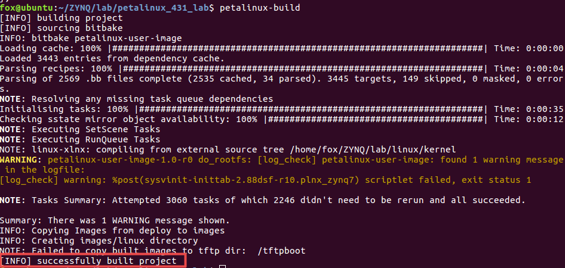

9. 打包工程，以生成 `BOOT.bin` 和 `image.ub`

   ```shell
   petalinux-package --boot --fsbl ./images/linux/zynq_fsbl.elf --fpga --u-boot --force
   ```

   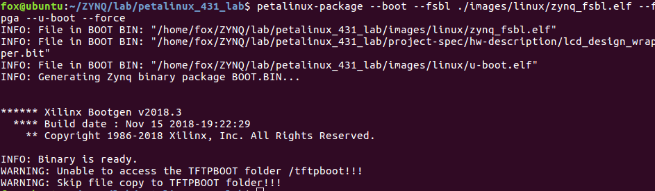

10. 将时候生成的 `BOOT.bin` 和 `image.ub` 拷贝到 SD（TF）卡

    ```shell
    su -l
    fdisk -l
    mount /dev/sdb1 /mnt/zynq/boot
    cd /home/fox/ZYNQ/lab/petalinux_431_lab/images/linux
    cp BOOT.bin image.ub /mnt/zynq/boot/
    umount /mnt/zynq/boot
    ```

#### 开发板验证

1. 将含有镜像的SD卡插入卡槽

2. 将开发板通过 JTAG 和 UART 接口连接电脑

3. 将网线插入到开发板

4. 将拨码开关切换到SD卡启动

5. 将USB的跳线帽插入（供电）

6. 将LCD显示屏插入到开发板 GPIO1 接口

7. 连接电源

   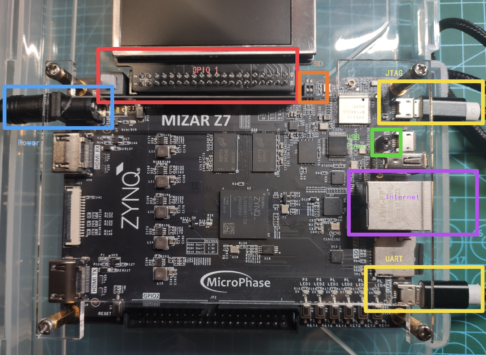

8. 启动端口通信工具并连接开发板

9. 启动开发板电源

10. 可以看到Linux系统成功启动，并且通过串口打印出了启动信息

    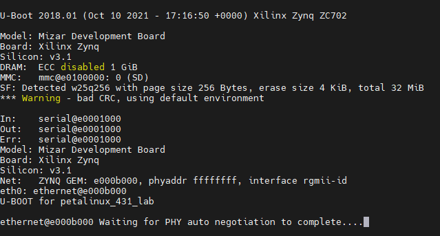

    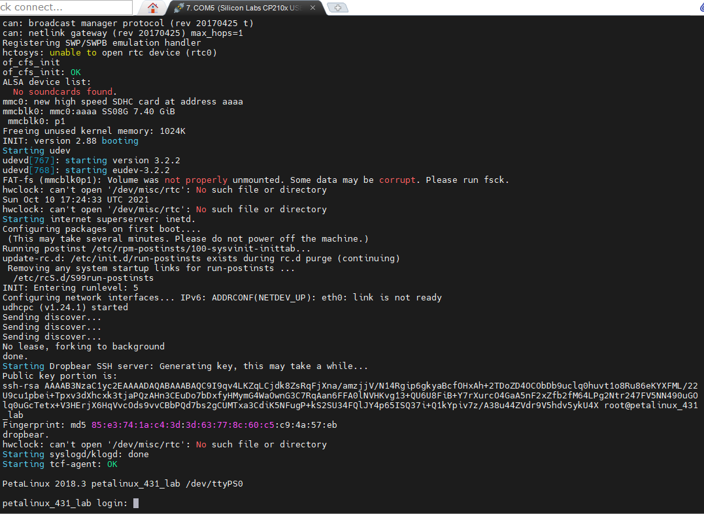

11. 屏幕也成功显示

    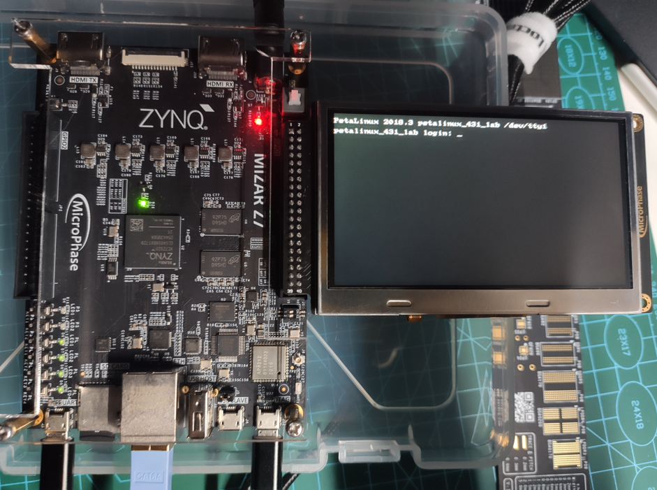

12. 此时我们把键盘插入 USB 口，可以看到终端上打印出了识别成功的信息

    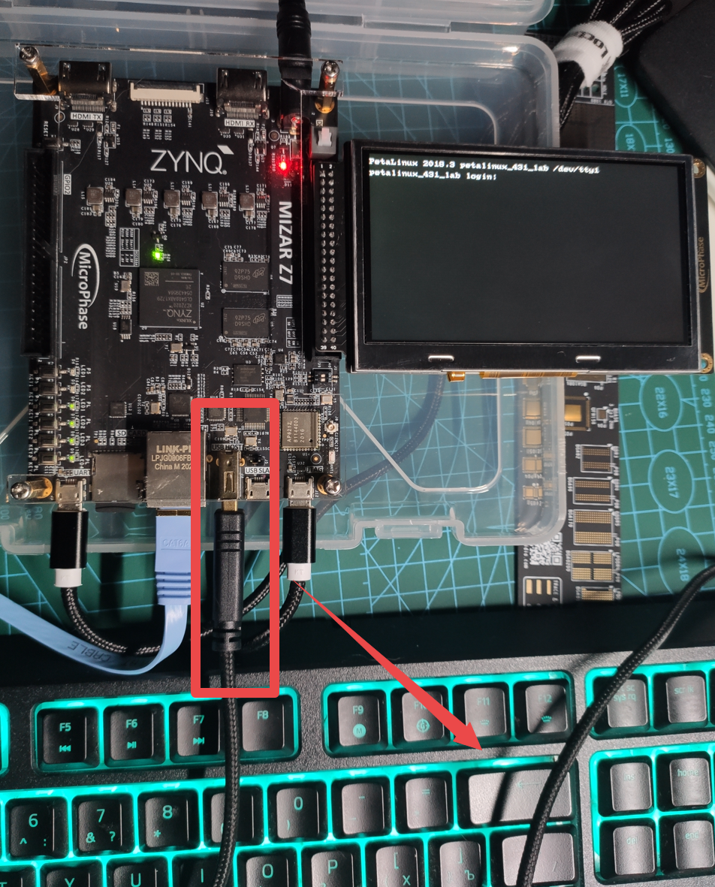

    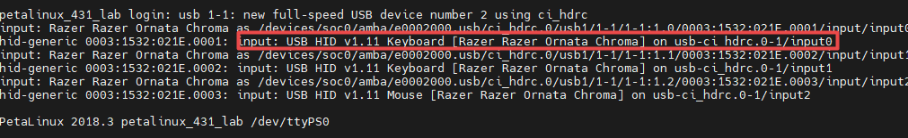

13. 键盘可以通过 USB 正常输入内容，并且网络也可以正常连接

    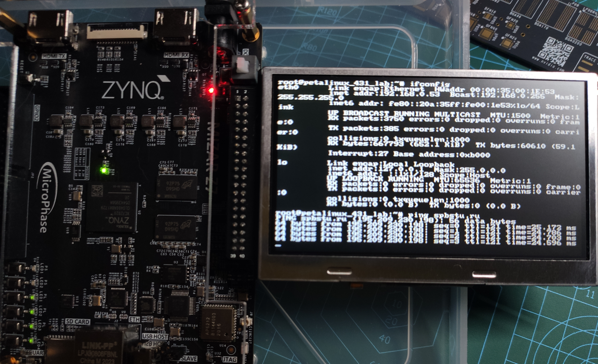

实验结束，取得成功


