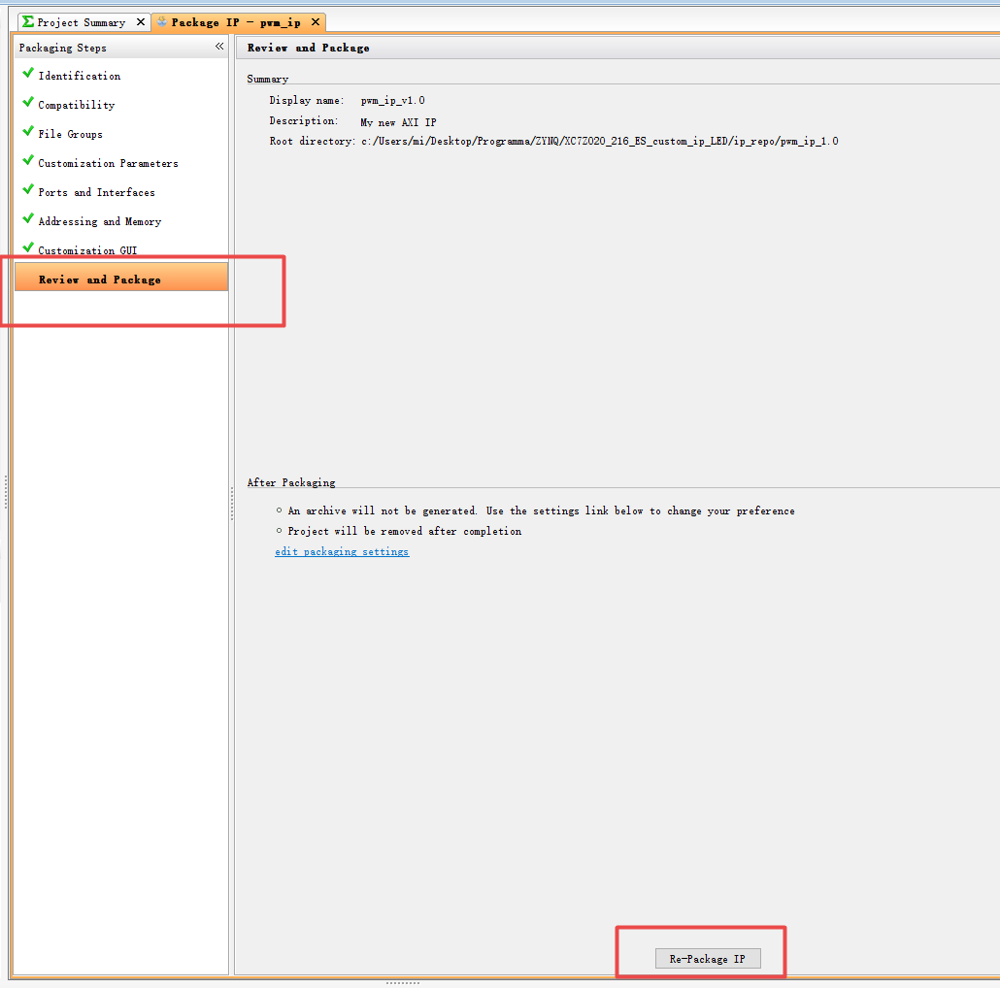
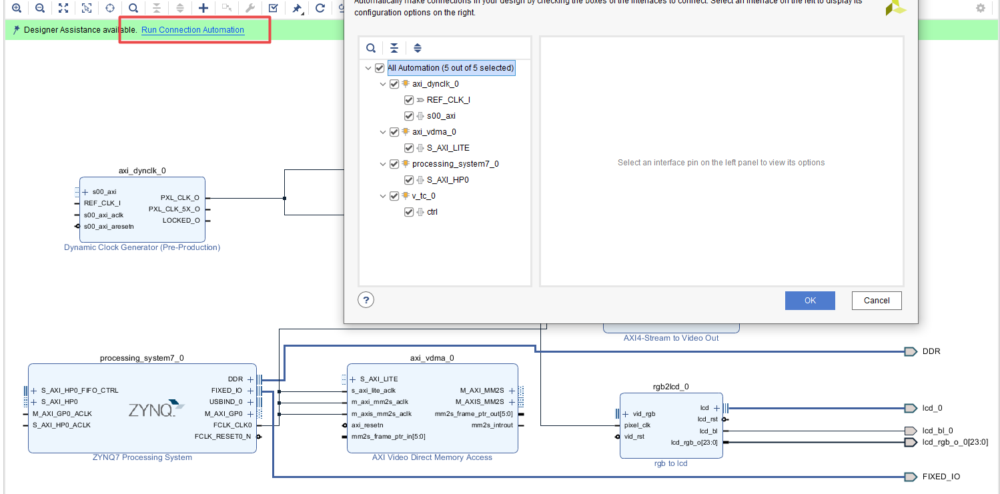
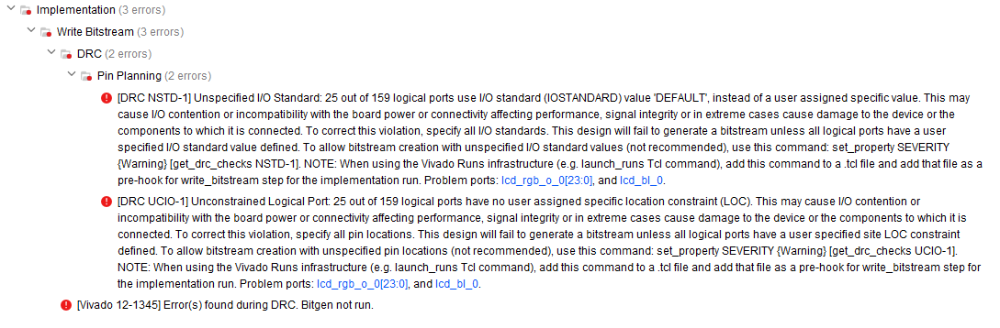
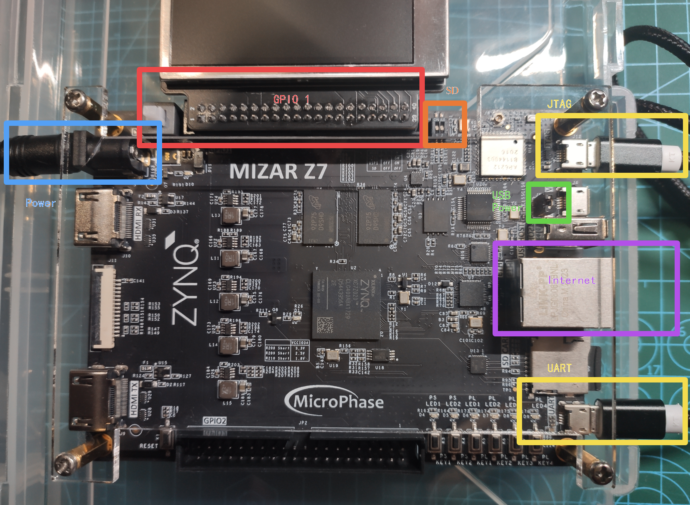

<p align="center">
 
 <h1 align="center">ZYNQ</h2>
 <p align="center"><b>Based on XC7Z020clg400-2 Soc</b></p>
</p>

<div align=center>

[](LICENSE)


<div align=left>

[toc]

### IP-ядра, определяемые пользователем

#### Инкапсуляция определяемых пользователем IP-ядер

1. Открыть Vivado

   

   

   

   Поскольку мы используем шину AXI, выберите  `Create a new AXI4 peripheral`

   

   Изменение названия

   

   

   Поскольку мы используем шину AXI, мы должны выполнить определенные настройки для шины AXI

   

   

   Добавление IP-адресов в хранилище

   

   

   可以看到我们创建的 IP 已经被添加到IP库中了

   Вы можете видеть, что IP, который мы создали, был добавлен в библиотеку IP

   

   

2. Редактирование IP-ядра 编辑 IP 核

   右键 IP 核，选择以下。会打开一个新的界面

   Щелкните правой кнопкой мыши на IP-ядре и выберите следующее. Откроется новый экран

   

   打开并添加端口

   Открывайте и добавляйте порты

   

   ```hdl
   `timescale 1ns / 1ps
   
   module pwm_ip(
       input sys_clk ,
       input sys_rst_n , 
       input [9:0] set_freq_step , 
       output pwm 
   );
    //*****************************************************
    //** main code
    //*****************************************************
    //reg define
   reg [15:0] period_cnt ; 
   reg [15:0] duty_cycle ; 
   reg inc_flag ; 
   //wire define
   wire led_t ;
   
   assign led_t = ( period_cnt <= duty_cycle ) ? 1'b1 : 1'b0 ;
   assign pwm = led_t;
   always @ (posedge sys_clk) begin
       if (!sys_rst_n)
           period_cnt <= 16'd0;
       else if( period_cnt == 16'd50_0000 )
           period_cnt <= 16'd0;
       else
           period_cnt <= period_cnt + 16'd1;
       end
   always @(posedge sys_clk) begin
       if (sys_rst_n == 1'b0) begin
           duty_cycle <= 16'd0;
           inc_flag <= 1'b0;
       end
       else if( period_cnt == 16'd50_0000 ) begin
           if( inc_flag ) begin 
               if( duty_cycle == 16'd0 )
                   inc_flag <= 1'b0;
               else if(duty_cycle < 10'd100)
                   duty_cycle <= 16'd0;
           else
               duty_cycle <= duty_cycle - set_freq_step;
           end
       else begin 
           if( duty_cycle >= 16'd50_0000 )
               inc_flag <= 1'b1;
           else
               duty_cycle <= duty_cycle + set_freq_step;
           end
       end
       else 
           duty_cycle <= duty_cycle ;
       end
    endmodule
   
   ```

   

   

   ```vhdl
   `timescale 1 ns / 1 ps
   
   	module pwm_ip_v1_0_S00_AXI #
   	(
   		// Users to add parameters here
           
   		// User parameters ends
   		// Do not modify the parameters beyond this line
   
   		// Width of S_AXI data bus
   		parameter integer C_S_AXI_DATA_WIDTH	= 32,
   		// Width of S_AXI address bus
   		parameter integer C_S_AXI_ADDR_WIDTH	= 4
   	)
   	(
   		// Users to add ports here
           output pwm,
   		// User ports ends
   		// Do not modify the ports beyond this line
   
   		// Global Clock Signal
   		input wire  S_AXI_ACLK,
   		// Global Reset Signal. This Signal is Active LOW
   		input wire  S_AXI_ARESETN,
   		// Write address (issued by master, acceped by Slave)
   		input wire [C_S_AXI_ADDR_WIDTH-1 : 0] S_AXI_AWADDR,
   		// Write channel Protection type. This signal indicates the
       		// privilege and security level of the transaction, and whether
       		// the transaction is a data access or an instruction access.
   		input wire [2 : 0] S_AXI_AWPROT,
   		// Write address valid. This signal indicates that the master signaling
       		// valid write address and control information.
   		input wire  S_AXI_AWVALID,
   		// Write address ready. This signal indicates that the slave is ready
       		// to accept an address and associated control signals.
   		output wire  S_AXI_AWREADY,
   		// Write data (issued by master, acceped by Slave) 
   		input wire [C_S_AXI_DATA_WIDTH-1 : 0] S_AXI_WDATA,
   		// Write strobes. This signal indicates which byte lanes hold
       		// valid data. There is one write strobe bit for each eight
       		// bits of the write data bus.    
   		input wire [(C_S_AXI_DATA_WIDTH/8)-1 : 0] S_AXI_WSTRB,
   		// Write valid. This signal indicates that valid write
       		// data and strobes are available.
   		input wire  S_AXI_WVALID,
   		// Write ready. This signal indicates that the slave
       		// can accept the write data.
   		output wire  S_AXI_WREADY,
   		// Write response. This signal indicates the status
       		// of the write transaction.
   		output wire [1 : 0] S_AXI_BRESP,
   		// Write response valid. This signal indicates that the channel
       		// is signaling a valid write response.
   		output wire  S_AXI_BVALID,
   		// Response ready. This signal indicates that the master
       		// can accept a write response.
   		input wire  S_AXI_BREADY,
   		// Read address (issued by master, acceped by Slave)
   		input wire [C_S_AXI_ADDR_WIDTH-1 : 0] S_AXI_ARADDR,
   		// Protection type. This signal indicates the privilege
       		// and security level of the transaction, and whether the
       		// transaction is a data access or an instruction access.
   		input wire [2 : 0] S_AXI_ARPROT,
   		// Read address valid. This signal indicates that the channel
       		// is signaling valid read address and control information.
   		input wire  S_AXI_ARVALID,
   		// Read address ready. This signal indicates that the slave is
       		// ready to accept an address and associated control signals.
   		output wire  S_AXI_ARREADY,
   		// Read data (issued by slave)
   		output wire [C_S_AXI_DATA_WIDTH-1 : 0] S_AXI_RDATA,
   		// Read response. This signal indicates the status of the
       		// read transfer.
   		output wire [1 : 0] S_AXI_RRESP,
   		// Read valid. This signal indicates that the channel is
       		// signaling the required read data.
   		output wire  S_AXI_RVALID,
   		// Read ready. This signal indicates that the master can
       		// accept the read data and response information.
   		input wire  S_AXI_RREADY
   	);
   
   	// AXI4LITE signals
   	reg [C_S_AXI_ADDR_WIDTH-1 : 0] 	axi_awaddr;
   	reg  	axi_awready;
   	reg  	axi_wready;
   	reg [1 : 0] 	axi_bresp;
   	reg  	axi_bvalid;
   	reg [C_S_AXI_ADDR_WIDTH-1 : 0] 	axi_araddr;
   	reg  	axi_arready;
   	reg [C_S_AXI_DATA_WIDTH-1 : 0] 	axi_rdata;
   	reg [1 : 0] 	axi_rresp;
   	reg  	axi_rvalid;
   
   	// Example-specific design signals
   	// local parameter for addressing 32 bit / 64 bit C_S_AXI_DATA_WIDTH
   	// ADDR_LSB is used for addressing 32/64 bit registers/memories
   	// ADDR_LSB = 2 for 32 bits (n downto 2)
   	// ADDR_LSB = 3 for 64 bits (n downto 3)
   	localparam integer ADDR_LSB = (C_S_AXI_DATA_WIDTH/32) + 1;
   	localparam integer OPT_MEM_ADDR_BITS = 1;
   	//----------------------------------------------
   	//-- Signals for user logic register space example
   	//------------------------------------------------
   	//-- Number of Slave Registers 4
   	reg [C_S_AXI_DATA_WIDTH-1:0]	slv_reg0;
   	reg [C_S_AXI_DATA_WIDTH-1:0]	slv_reg1;
   	reg [C_S_AXI_DATA_WIDTH-1:0]	slv_reg2;
   	reg [C_S_AXI_DATA_WIDTH-1:0]	slv_reg3;
   	wire	 slv_reg_rden;
   	wire	 slv_reg_wren;
   	reg [C_S_AXI_DATA_WIDTH-1:0]	 reg_data_out;
   	integer	 byte_index;
   	reg	 aw_en;
   
   	// I/O Connections assignments
   
   	assign S_AXI_AWREADY	= axi_awready;
   	assign S_AXI_WREADY	= axi_wready;
   	assign S_AXI_BRESP	= axi_bresp;
   	assign S_AXI_BVALID	= axi_bvalid;
   	assign S_AXI_ARREADY	= axi_arready;
   	assign S_AXI_RDATA	= axi_rdata;
   	assign S_AXI_RRESP	= axi_rresp;
   	assign S_AXI_RVALID	= axi_rvalid;
   	// Implement axi_awready generation
   	// axi_awready is asserted for one S_AXI_ACLK clock cycle when both
   	// S_AXI_AWVALID and S_AXI_WVALID are asserted. axi_awready is
   	// de-asserted when reset is low.
   
   	always @( posedge S_AXI_ACLK )
   	begin
   	  if ( S_AXI_ARESETN == 1'b0 )
   	    begin
   	      axi_awready <= 1'b0;
   	      aw_en <= 1'b1;
   	    end 
   	  else
   	    begin    
   	      if (~axi_awready && S_AXI_AWVALID && S_AXI_WVALID && aw_en)
   	        begin
   	          // slave is ready to accept write address when 
   	          // there is a valid write address and write data
   	          // on the write address and data bus. This design 
   	          // expects no outstanding transactions. 
   	          axi_awready <= 1'b1;
   	          aw_en <= 1'b0;
   	        end
   	        else if (S_AXI_BREADY && axi_bvalid)
   	            begin
   	              aw_en <= 1'b1;
   	              axi_awready <= 1'b0;
   	            end
   	      else           
   	        begin
   	          axi_awready <= 1'b0;
   	        end
   	    end 
   	end       
   
   	// Implement axi_awaddr latching
   	// This process is used to latch the address when both 
   	// S_AXI_AWVALID and S_AXI_WVALID are valid. 
   
   	always @( posedge S_AXI_ACLK )
   	begin
   	  if ( S_AXI_ARESETN == 1'b0 )
   	    begin
   	      axi_awaddr <= 0;
   	    end 
   	  else
   	    begin    
   	      if (~axi_awready && S_AXI_AWVALID && S_AXI_WVALID && aw_en)
   	        begin
   	          // Write Address latching 
   	          axi_awaddr <= S_AXI_AWADDR;
   	        end
   	    end 
   	end       
   
   	// Implement axi_wready generation
   	// axi_wready is asserted for one S_AXI_ACLK clock cycle when both
   	// S_AXI_AWVALID and S_AXI_WVALID are asserted. axi_wready is 
   	// de-asserted when reset is low. 
   
   	always @( posedge S_AXI_ACLK )
   	begin
   	  if ( S_AXI_ARESETN == 1'b0 )
   	    begin
   	      axi_wready <= 1'b0;
   	    end 
   	  else
   	    begin    
   	      if (~axi_wready && S_AXI_WVALID && S_AXI_AWVALID && aw_en )
   	        begin
   	          // slave is ready to accept write data when 
   	          // there is a valid write address and write data
   	          // on the write address and data bus. This design 
   	          // expects no outstanding transactions. 
   	          axi_wready <= 1'b1;
   	        end
   	      else
   	        begin
   	          axi_wready <= 1'b0;
   	        end
   	    end 
   	end       
   
   	// Implement memory mapped register select and write logic generation
   	// The write data is accepted and written to memory mapped registers when
   	// axi_awready, S_AXI_WVALID, axi_wready and S_AXI_WVALID are asserted. Write strobes are used to
   	// select byte enables of slave registers while writing.
   	// These registers are cleared when reset (active low) is applied.
   	// Slave register write enable is asserted when valid address and data are available
   	// and the slave is ready to accept the write address and write data.
   	assign slv_reg_wren = axi_wready && S_AXI_WVALID && axi_awready && S_AXI_AWVALID;
   
   	always @( posedge S_AXI_ACLK )
   	begin
   	  if ( S_AXI_ARESETN == 1'b0 )
   	    begin
   	      slv_reg0 <= 0;
   	      slv_reg1 <= 0;
   	      slv_reg2 <= 0;
   	      slv_reg3 <= 0;
   	    end 
   	  else begin
   	    if (slv_reg_wren)
   	      begin
   	        case ( axi_awaddr[ADDR_LSB+OPT_MEM_ADDR_BITS:ADDR_LSB] )
   	          2'h0:
   	            for ( byte_index = 0; byte_index <= (C_S_AXI_DATA_WIDTH/8)-1; byte_index = byte_index+1 )
   	              if ( S_AXI_WSTRB[byte_index] == 1 ) begin
   	                // Respective byte enables are asserted as per write strobes 
   	                // Slave register 0
   	                slv_reg0[(byte_index*8) +: 8] <= S_AXI_WDATA[(byte_index*8) +: 8];
   	              end  
   	          2'h1:
   	            for ( byte_index = 0; byte_index <= (C_S_AXI_DATA_WIDTH/8)-1; byte_index = byte_index+1 )
   	              if ( S_AXI_WSTRB[byte_index] == 1 ) begin
   	                // Respective byte enables are asserted as per write strobes 
   	                // Slave register 1
   	                slv_reg1[(byte_index*8) +: 8] <= S_AXI_WDATA[(byte_index*8) +: 8];
   	              end  
   	          2'h2:
   	            for ( byte_index = 0; byte_index <= (C_S_AXI_DATA_WIDTH/8)-1; byte_index = byte_index+1 )
   	              if ( S_AXI_WSTRB[byte_index] == 1 ) begin
   	                // Respective byte enables are asserted as per write strobes 
   	                // Slave register 2
   	                slv_reg2[(byte_index*8) +: 8] <= S_AXI_WDATA[(byte_index*8) +: 8];
   	              end  
   	          2'h3:
   	            for ( byte_index = 0; byte_index <= (C_S_AXI_DATA_WIDTH/8)-1; byte_index = byte_index+1 )
   	              if ( S_AXI_WSTRB[byte_index] == 1 ) begin
   	                // Respective byte enables are asserted as per write strobes 
   	                // Slave register 3
   	                slv_reg3[(byte_index*8) +: 8] <= S_AXI_WDATA[(byte_index*8) +: 8];
   	              end  
   	          default : begin
   	                      slv_reg0 <= slv_reg0;
   	                      slv_reg1 <= slv_reg1;
   	                      slv_reg2 <= slv_reg2;
   	                      slv_reg3 <= slv_reg3;
   	                    end
   	        endcase
   	      end
   	  end
   	end    
   
   	// Implement write response logic generation
   	// The write response and response valid signals are asserted by the slave 
   	// when axi_wready, S_AXI_WVALID, axi_wready and S_AXI_WVALID are asserted.  
   	// This marks the acceptance of address and indicates the status of 
   	// write transaction.
   
   	always @( posedge S_AXI_ACLK )
   	begin
   	  if ( S_AXI_ARESETN == 1'b0 )
   	    begin
   	      axi_bvalid  <= 0;
   	      axi_bresp   <= 2'b0;
   	    end 
   	  else
   	    begin    
   	      if (axi_awready && S_AXI_AWVALID && ~axi_bvalid && axi_wready && S_AXI_WVALID)
   	        begin
   	          // indicates a valid write response is available
   	          axi_bvalid <= 1'b1;
   	          axi_bresp  <= 2'b0; // 'OKAY' response 
   	        end                   // work error responses in future
   	      else
   	        begin
   	          if (S_AXI_BREADY && axi_bvalid) 
   	            //check if bready is asserted while bvalid is high) 
   	            //(there is a possibility that bready is always asserted high)   
   	            begin
   	              axi_bvalid <= 1'b0; 
   	            end  
   	        end
   	    end
   	end   
   
   	// Implement axi_arready generation
   	// axi_arready is asserted for one S_AXI_ACLK clock cycle when
   	// S_AXI_ARVALID is asserted. axi_awready is 
   	// de-asserted when reset (active low) is asserted. 
   	// The read address is also latched when S_AXI_ARVALID is 
   	// asserted. axi_araddr is reset to zero on reset assertion.
   
   	always @( posedge S_AXI_ACLK )
   	begin
   	  if ( S_AXI_ARESETN == 1'b0 )
   	    begin
   	      axi_arready <= 1'b0;
   	      axi_araddr  <= 32'b0;
   	    end 
   	  else
   	    begin    
   	      if (~axi_arready && S_AXI_ARVALID)
   	        begin
   	          // indicates that the slave has acceped the valid read address
   	          axi_arready <= 1'b1;
   	          // Read address latching
   	          axi_araddr  <= S_AXI_ARADDR;
   	        end
   	      else
   	        begin
   	          axi_arready <= 1'b0;
   	        end
   	    end 
   	end       
   
   	// Implement axi_arvalid generation
   	// axi_rvalid is asserted for one S_AXI_ACLK clock cycle when both 
   	// S_AXI_ARVALID and axi_arready are asserted. The slave registers 
   	// data are available on the axi_rdata bus at this instance. The 
   	// assertion of axi_rvalid marks the validity of read data on the 
   	// bus and axi_rresp indicates the status of read transaction.axi_rvalid 
   	// is deasserted on reset (active low). axi_rresp and axi_rdata are 
   	// cleared to zero on reset (active low).  
   	always @( posedge S_AXI_ACLK )
   	begin
   	  if ( S_AXI_ARESETN == 1'b0 )
   	    begin
   	      axi_rvalid <= 0;
   	      axi_rresp  <= 0;
   	    end 
   	  else
   	    begin    
   	      if (axi_arready && S_AXI_ARVALID && ~axi_rvalid)
   	        begin
   	          // Valid read data is available at the read data bus
   	          axi_rvalid <= 1'b1;
   	          axi_rresp  <= 2'b0; // 'OKAY' response
   	        end   
   	      else if (axi_rvalid && S_AXI_RREADY)
   	        begin
   	          // Read data is accepted by the master
   	          axi_rvalid <= 1'b0;
   	        end                
   	    end
   	end    
   
   	// Implement memory mapped register select and read logic generation
   	// Slave register read enable is asserted when valid address is available
   	// and the slave is ready to accept the read address.
   	assign slv_reg_rden = axi_arready & S_AXI_ARVALID & ~axi_rvalid;
   	always @(*)
   	begin
   	      // Address decoding for reading registers
   	      case ( axi_araddr[ADDR_LSB+OPT_MEM_ADDR_BITS:ADDR_LSB] )
   	        2'h0   : reg_data_out <= slv_reg0;
   	        2'h1   : reg_data_out <= slv_reg1;
   	        2'h2   : reg_data_out <= slv_reg2;
   	        2'h3   : reg_data_out <= slv_reg3;
   	        default : reg_data_out <= 0;
   	      endcase
   	end
   
   	// Output register or memory read data
   	always @( posedge S_AXI_ACLK )
   	begin
   	  if ( S_AXI_ARESETN == 1'b0 )
   	    begin
   	      axi_rdata  <= 0;
   	    end 
   	  else
   	    begin    
   	      // When there is a valid read address (S_AXI_ARVALID) with 
   	      // acceptance of read address by the slave (axi_arready), 
   	      // output the read dada 
   	      if (slv_reg_rden)
   	        begin
   	          axi_rdata <= reg_data_out;     // register read data
   	        end   
   	    end
   	end    
   
   	// Add user logic here
       pwm_ip u_pwm_ip(
           .sys_clk (S_AXI_ACLK),
           .sys_rst_n (S_AXI_ARESETN),
           .set_freq_step (slv_reg1[9:0]),
           .pwm (pwm)
       );
   	// User logic ends
   
   	endmodule
   
   ```

   

   

   

   

   编辑此文件

   Редактирование этого документа

   

   添加以下代码

   Добавьте следующий код

   ```hdl
   module pwm_ip(
       input sys_clk ,
       input sys_rst_n , 
       input [9:0] set_freq_step , 
       output pwm 
   );
    //*****************************************************
    //** main code
    //*****************************************************
    //reg define
   reg [15:0] period_cnt ; 
   reg [15:0] duty_cycle ; 
   reg inc_flag ; 
   //wire define
   wire led_t ;
   
   assign led_t = ( period_cnt <= duty_cycle ) ? 1'b1 : 1'b0 ;
   assign pwm = led_t;
   always @ (posedge sys_clk) begin
       if (!sys_rst_n)
           period_cnt <= 16'd0;
       else if( period_cnt == 16'd50_0000 )
           period_cnt <= 16'd0;
       else
           period_cnt <= period_cnt + 16'd1;
       end
   always @(posedge sys_clk) begin
       if (sys_rst_n == 1'b0) begin
           duty_cycle <= 16'd0;
           inc_flag <= 1'b0;
       end
       else if( period_cnt == 16'd50_0000 ) begin
           if( inc_flag ) begin 
               if( duty_cycle == 16'd0 )
                   inc_flag <= 1'b0;
               else if(duty_cycle < 10'd100)
                   duty_cycle <= 16'd0;
           else
               duty_cycle <= duty_cycle - set_freq_step;
           end
       else begin 
           if( duty_cycle >= 16'd50_0000 )
               inc_flag <= 1'b1;
           else
               duty_cycle <= duty_cycle + set_freq_step;
           end
       end
       else 
           duty_cycle <= duty_cycle ;
       end
    endmodule
   
   ```

   

3. 进行仿真

   Проведение симуляций

   

   

   

4. 点击以下文件

   Нажмите на следующие документы

   修改支持器件类型

   Изменение поддерживаемых типов устройств

   

   

   点击

   

   

   

   

   

   

### Запуск Linux на экране User Defined IP (LCD)      用户自定义IP（LCD）屏幕上运行 Linux

任务说明：

本实验使用了用户自定义IP核（LCD屏幕），并在Vivado进行硬件设计之后通过 PetaLinux 工具编译、配置、打包以获得`BOOT.bin` 和 `image.ug` 文件，最终实现开发板运行定制的 Linux 操作系统并驱动LCD屏幕显示。

Описание задачи.

В данном эксперименте используется пользовательское IP-ядро (LCD-экран), которое компилируется, конфигурируется и упаковывается инструментом PetaLinux после проектирования аппаратного обеспечения в Vivado для получения файлов `BOOT.bin` и `image.ug`, чтобы в итоге плата разработки могла запускать пользовательскую операционную систему Linux и управлять LCD-дисплеем.

---

Аппаратная платформа：

- Board：Mizar Z7
- SoC：Zynq-7 XC7Z020clg400-2
- LCD：MLCD-43D_R10
- SD：SanDisk 8Gb TF

Программные платформы：

- Ubuntu 16.04 x64
- Vivado v2018.3
- SDK v2018.3
- PetaLinux v2018.3
- Kernel：Linux-4.14

---

分为以下三大部分：

- Vivado 硬件设计部分（获取 `system.hdf` 硬件描述文件）
- PetaLinux 配置（获取`BOOT.bin` 和 `image.ug` 镜像文件）
- 开发板验证

Он состоит из трех основных разделов.

- Раздел проектирования аппаратного обеспечения Vivado (получение файла описания аппаратного обеспечения system.hdf)
- Настройка PetaLinux (получение файлов образов BOOT.bin и image.ug)
- Проверка платы разработки

  #### Раздел проектирования Vivado (импорт необходимых ИС и получение файлов описания аппаратного обеспечения hdf)	Vivado 设计部分（所需IP的导入及hdf硬件描述文件的获取）

1. Создайте новый проект Vivado, который здесь не описывается

   新建 Vivado 工程，这里不再赘述

   

2. Импорт пользовательских IP-ядер

   

   Вы можете видеть, что Vivado автоматически распознает IP-ядра, которые мы создаем

   

3. Импорт и конфигурирование IP-ядер Zynq7

   导入 Zynq7 IP核并配置

   

   Поскольку в дальнейшем мы будем использовать Flash, сеть, USB, SD-карту и последовательную связь, мы настроим каждый порт в соответствии со схемой платы разработки следующим образом

   因为我们之后会使用 Flash、网络、USB、SD卡、串口通信；所以按照开发板的原理图，我们将各个端口做以下设置

   

   Включение S_AXI_HP0 

   使能 S_AXI_HP0 

   

   Чтобы адаптироваться к ЖК-экрану, мы установили выходную частоту PL на 100

   为了适配 LCD 屏幕，我们将PL的输出频率设置为100

   

   Нажмите кнопку Interrupt, чтобы включить порт ввода прерывания на стороне PL - PS

   点击 Interrupt，使能 PL 到 PS 端的中断输入端口

   

   После завершения настройки вы получите следующие данные

   配置完成后，得到如下所示

   

4. Импорт VDMA IP

   导入 VDMA IP

   > VDMA считывает данные, затем преобразует поток данных в поток видеопротокола через IP-ядро AXI4-Stream to Video Out, после чего преобразует поток в временную последовательность, соответствующую интерфейсу RGB LCD. Затем данные преобразуются в временную последовательность, которая соответствует интерфейсу RGB LCD и может быть отображена на экране LCD.
   >
   > 
   >
   > 使用 VDMA IP 核来实现对于 AXI4-Stream 类目标外设的高带宽直接存储器存取来读取 DDR 中的数据。VDMA 读取到数据之后通过 AXI4-Stream to Video Out IP 核将数据流转换成视频协议的数据流，之后在将该数据流转换为符合 RGB LCD 接口的时序就可以在 LCD 屏幕上显示了。

   Опция `Frame Buffers` позволяет выбрать количество мест хранения буфера кадров, которые будут обрабатываться AXI VDMA. Поскольку в данном эксперименте выводится только одно изображение и данные записываются только один раз, нет необходимости устанавливать более одной области кадрового буфера, поэтому установлено значение 1. Поскольку в данном эксперименте данные считываются с DDR3 на ЖК-дисплей, необходимо проверить только Enable Read Channel, поэтому нет необходимости проверять Enable Write Channel.

   Опция `Memory Map Data Width` позволяет выбрать необходимую ширину данных AXI4 для канала MM2S. Оставьте здесь значение по умолчанию 64

   `Read Burst Size` используется для указания размера серии чтения, здесь выберите 64

   Опция `Stream Data Width` позволяет выбрать ширину данных AXI4-Stream для канала MM2S. Допустимые значения кратны 8 вплоть до 1024. Обратите внимание, что это значение должно быть меньше или равно ширине данных карты памяти, которая установлена на 24 для формата выходных данных RGB888.

   Опция `Line Buffer Depth` позволяет выбрать глубину буфера линии (ширина буфера линии - это размер данных потока) для канала MM2S, здесь установлено значение 2048.

   

   `Frame Buffers` 选项可以选择 AXI VDMA 要处理的帧缓冲存储位置 的数量。由于本次显示实验只显示一张图片，数据只需要写入一次，因此不需要 设置多个帧缓存区域，这里设置为 1。因为本实验是从 DDR3 中读取数据输出给 LCD，所以只需要勾选 Enable Read Channel 就可以了，无需勾选 Enable Write Channel。

   `Memory Map Data Width` 选项可以为 MM2S 通道选择所需的 AXI4 数据宽度。此处保持默认 64 即可

   `Read Burst Size` 用于指定突发读的大小，此处选择 64

   `Stream Data Width` 选 项可以选择 MM2S 通道的 AXI4-Stream 数据宽度。 有效值是 8 的倍数，最大 到 1024。 必须注意的是该值必须小于或等于 Memory Map Data Width。**此处因输出数据格式为 RGB888，设置为 24**

   `Line Buffer Depth` 选项可以选择 MM2S 通道的行缓冲深度（行缓冲区宽度 为 stream data 的大小） ，此处设置 **2048**

   

5. Импорт таймингового IP ядра (контроллер тайминга видео)

   导入 Timing IP核 （视频时序控制器）

   配置如下

   

   

6. Импорт video out (контроллер вывода видео)

   导入 video out（视频输出控制器）

   Здесь мы используем независимые часы в качестве входа, поэтому выберите независимые часы.

   这里我们使用了独立时钟作为输入，所以选择独立时钟

   

7. **Импортировать индивидуальный ЖК-IP** 

   **导入自定义LCD IP**

   `Reddepth`、 `Greendepth` 、` Buledepth` используется для установки количества выводимых битов красного, зеленого и синего цветов.Здесь мы используем RGB888, поэтому установите его на 8, 8 и 8 соответственно.

   `Vid In Data Width` используется для указания ширины входной шины RGB, 24 бита
   `Vid Out Data Width` используется для указания ширины выходной шины RGB, 24 бита

   

   `Reddepth`、` Greendepth` 和 `Buledepth` 用于 设置输出的 Red、Green 和 Blue 颜色的位数，这里我们使用 RGB888，所以分别设置为 8、8、8

   `Vid In Data Width` 用于指定输入的 RGB 总线宽度，为 24 位

   `Vid Out Data Width` 用于指定输出的 RGB 总线宽度，为 24 位

   

8. Импорт динамического динамического тактового контроллера IP

   导入dynamic 动态时钟控制器 IP

   

9. Поскольку автоматическое соединение Vivado вызовет ошибки, мы вручную распределяем тактовый сигнал здесь следующим образом

   因为 Vivado 自动连接会导致错误，所以我们这里手动分配时钟信号如下

   

10. Используйте Vivado для автоматического экспорта контактов IP-ядра Zynq7
    PS

    使用 Vivado自动导出 Zynq7 PS IP核 的引脚

    

11. Вручную выведите соответствующие пины кастомного IP

    手动引出 自定义 IP 的相关引脚

     

12. Пусть Vivado автоматически подключит для нас соответствующие пины

    让 Vivado 自动帮我们连接相关引脚

     

13. После завершения подключения некоторые сигналы не могут быть подключены автоматически, и их необходимо подключать вручную

    连接完成后部分信号无法自动连接，需手动连接

14.  

15. Получите следующий дизайн

    得到以下设计

     

16. Импортируйте ядро Concat IP для подключения сигнала прерывания

    导入 Concat IP核，以连接中断信号

    Подключите сигнал прерывания mm2s_introut VDMA и сигнал прерывания irq контроллера синхронизации видео к входному терминалу concat IP и подключите выходной терминал Concat к входному терминалу сигнала прерывания системы обработки ZYNQ7.

     连接 VDMA 的 mm2s_introut 中断信号和 Video Timing Controller 的 irq 中断信号到 concat IP 的输入端，连接 Concat 的输出端到 ZYNQ7 Processing System 的中断信号输入端

     

17. В итоге получил следующий дизайн

    最终得到以下设计

     

18. Создание файлов HDL верхнего уровня

    生成顶层 HDL 文件

     

     

19. Используется GPIO0, поэтому мы делаем ограничения по выводам на основе принципиальной схемы платы разработки и ЖК-экрана

    使用了GPIO0，所以我们根据开发板和LCD屏幕的原理图进行引脚约束

     

    ```xdc
    set_property IOSTANDARD LVCMOS33 [get_ports lcd_lcd_hs]
    set_property IOSTANDARD LVCMOS33 [get_ports lcd_lcd_vs]
    set_property IOSTANDARD LVCMOS33 [get_ports lcd_lcd_de]
    set_property IOSTANDARD LVCMOS33 [get_ports lcd_lcd_pclk]
    set_property IOSTANDARD LVCMOS33 [get_ports lcd_bl0]
    set_property IOSTANDARD LVCMOS33 [get_ports {lcd_rgb_o[23]}]
    set_property IOSTANDARD LVCMOS33 [get_ports {lcd_rgb_o[22]}]
    set_property IOSTANDARD LVCMOS33 [get_ports {lcd_rgb_o[21]}]
    set_property IOSTANDARD LVCMOS33 [get_ports {lcd_rgb_o[20]}]
    set_property IOSTANDARD LVCMOS33 [get_ports {lcd_rgb_o[19]}]
    set_property IOSTANDARD LVCMOS33 [get_ports {lcd_rgb_o[18]}]
    set_property IOSTANDARD LVCMOS33 [get_ports {lcd_rgb_o[17]}]
    set_property IOSTANDARD LVCMOS33 [get_ports {lcd_rgb_o[16]}]
    set_property IOSTANDARD LVCMOS33 [get_ports {lcd_rgb_o[15]}]
    set_property IOSTANDARD LVCMOS33 [get_ports {lcd_rgb_o[14]}]
    set_property IOSTANDARD LVCMOS33 [get_ports {lcd_rgb_o[13]}]
    set_property IOSTANDARD LVCMOS33 [get_ports {lcd_rgb_o[12]}]
    set_property IOSTANDARD LVCMOS33 [get_ports {lcd_rgb_o[11]}]
    set_property IOSTANDARD LVCMOS33 [get_ports {lcd_rgb_o[10]}]
    set_property IOSTANDARD LVCMOS33 [get_ports {lcd_rgb_o[9]}]
    set_property IOSTANDARD LVCMOS33 [get_ports {lcd_rgb_o[8]}]
    set_property IOSTANDARD LVCMOS33 [get_ports {lcd_rgb_o[7]}]
    set_property IOSTANDARD LVCMOS33 [get_ports {lcd_rgb_o[6]}]
    set_property IOSTANDARD LVCMOS33 [get_ports {lcd_rgb_o[5]}]
    set_property IOSTANDARD LVCMOS33 [get_ports {lcd_rgb_o[4]}]
    set_property IOSTANDARD LVCMOS33 [get_ports {lcd_rgb_o[3]}]
    set_property IOSTANDARD LVCMOS33 [get_ports {lcd_rgb_o[2]}]
    set_property IOSTANDARD LVCMOS33 [get_ports {lcd_rgb_o[1]}]
    set_property IOSTANDARD LVCMOS33 [get_ports {lcd_rgb_o[0]}]
    set_property PACKAGE_PIN V13 [get_ports lcd_lcd_de]
    set_property PACKAGE_PIN U15 [get_ports lcd_lcd_hs]
    set_property PACKAGE_PIN Y14 [get_ports lcd_lcd_pclk]
    set_property PACKAGE_PIN U14 [get_ports lcd_lcd_vs]
    set_property PACKAGE_PIN W14 [get_ports lcd_bl0]
    set_property PACKAGE_PIN W19 [get_ports {lcd_rgb_o[0]}]
    set_property PACKAGE_PIN W18 [get_ports {lcd_rgb_o[1]}]
    set_property PACKAGE_PIN U19 [get_ports {lcd_rgb_o[2]}]
    set_property PACKAGE_PIN U18 [get_ports {lcd_rgb_o[3]}]
    set_property PACKAGE_PIN W16 [get_ports {lcd_rgb_o[4]}]
    set_property PACKAGE_PIN V16 [get_ports {lcd_rgb_o[5]}]
    set_property PACKAGE_PIN W15 [get_ports {lcd_rgb_o[6]}]
    set_property PACKAGE_PIN V15 [get_ports {lcd_rgb_o[7]}]
    set_property PACKAGE_PIN P19 [get_ports {lcd_rgb_o[8]}]
    set_property PACKAGE_PIN W20 [get_ports {lcd_rgb_o[9]}]
    set_property PACKAGE_PIN V20 [get_ports {lcd_rgb_o[10]}]
    set_property PACKAGE_PIN Y19 [get_ports {lcd_rgb_o[11]}]
    set_property PACKAGE_PIN N18 [get_ports {lcd_rgb_o[12]}]
    set_property PACKAGE_PIN Y18 [get_ports {lcd_rgb_o[13]}]
    set_property PACKAGE_PIN Y17 [get_ports {lcd_rgb_o[14]}]
    set_property PACKAGE_PIN Y16 [get_ports {lcd_rgb_o[15]}]
    set_property PACKAGE_PIN U20 [get_ports {lcd_rgb_o[16]}]
    set_property PACKAGE_PIN T20 [get_ports {lcd_rgb_o[17]}]
    set_property PACKAGE_PIN R18 [get_ports {lcd_rgb_o[18]}]
    set_property PACKAGE_PIN T17 [get_ports {lcd_rgb_o[19]}]
    set_property PACKAGE_PIN P20 [get_ports {lcd_rgb_o[20]}]
    set_property PACKAGE_PIN N20 [get_ports {lcd_rgb_o[21]}]
    set_property PACKAGE_PIN P18 [get_ports {lcd_rgb_o[22]}]
    set_property PACKAGE_PIN N17 [get_ports {lcd_rgb_o[23]}]
    ```

     

20. Поскольку мы используем ресурсы на стороне PL, нам нужно сгенерировать файл битового потока

    因为我们使用到了PL端的资源，所以我们需要生成比特流文件

     

21. Vivado сообщает, что существует ошибка, из-за которой не удается сгенерировать поток битов; после проверки ошибка заключается в том, что имя порта нашего настраиваемого IP-адреса ЖК-экрана не соответствует файлу XDC, поэтому мы его модифицируем.

    Vivado提示有错误无法生成比特流；经过查看，错误为我们自定义的LCD屏幕IP的端口名称与XDC文件中的不匹配，所以我们进行修改

     

    Переименуйте порт:

    重命名端口：

     

22.  сгенерировать файл битового потока

    重新生成比特流，成功

     

23. Экспорт аппаратное обеспечение

    导出到硬件

     

     

24. Запускаем SDK

    启动 SDK

25. Успешно получили файл описания оборудования, который нам нужен `system.hdf`

    成功得到了我们需要用到的硬件描述文件 `system.hdf`


#### 使用 PetaLinux 生成镜像文件

1. 启动 PetaLinux 工具

   ```shell
   source ./petalinux/settings.sh
   ```

   

2. 创建工程

   ```shell
   petalinux-create --type project --template zynq --name petalinux_431_lab
   ```

   

3. 进入工程，并使用 WinSCP 工具将我们获取的硬件描述文件导入当前工程目录

   

4. 配置工程

   ```shell
   petalinux_config –get-hw-description=.
   ```

   

5. 将内核修为本地内核

   

   

   

   

   

   之后保存退出

   

6. 配置内核

   ```shell
   petalinux-config –c kernel
   ```

   

   

   

   保存退出

   

7. 添加（修改）设备树

   ```shell
   vim project-spec/meta-user/recipes-bsp/device-tree/files/system-user.dtsi
   ```

   ```c
   /include/ "system-conf.dtsi"
   
   #define GPIO_ACTIVE_HIGH 0
   #define GPIO_ACTIVE_LOW  1
   
   / {  
       model = "Mizar Development Board"; 
       compatible = "microphase,zynq-7010","xlnx,zynq-7000"; 
   
   	usb_phy0:usb_phy@0{
   		compatible = "ulpi-phy";
   		#phy-cells = <0>;
   		reg = <0xe0002000 0x1000>;
   		view-port = <0x170>;
   		drv-vbus;
   	};
   
       video_timings {
               timing_4x3_480x272: timing0 {
                   clock-frequency = <9000000>;
                   hactive = <480>;
                   vactive = <272>;
       
                   hback-porch = <40>;
                   hsync-len = <20>;
                   hfront-porch = <5>;
                   vback-porch = <8>;
                   vsync-len = <3>;
                   vfront-porch = <8>;
       
                   hsync-active = <0>;
                   vsync-active = <0>;
                   de-active = <1>;
                   pixelclk-active = <0>;
               };
   
               timing_1920x1080: timing1 {
                       clock-frequency = <148500000>;
                       hactive = <1920>;
                       vactive = <1080>;
   
                       hback-porch = <148>;
                       hsync-len = <44>;
                       hfront-porch = <88>;
                       vback-porch = <36>;
                       vsync-len = <5>;
                       vfront-porch = <4>;
   
                       hsync-active = <0>;
                       vsync-active = <0>;
                       de-active = <1>;
                       pixelclk-active = <1>;
               };
       };       
   };
   
   &usb0{
   	dr_mode = "host";
   	usb-phy = <&usb_phy0>;
   };
   &axi_dynclk_0 {
       compatible = "digilent,axi-dynclk";
       clocks = <&clkc 15>;
       #clock-cells = <0>;
   };
   
   &v_tc_0 {
       compatible = "xlnx,v-tc-5.01.a";
   };
   
   &amba_pl {
       xlnx_vdma_lcd {
           compatible = "xilinx,vdmafb";
           status = "okay";
   
           xlnx,vtc = <&v_tc_0>;
           clocks = <&axi_dynclk_0>;
           clock-names = "lcd_pclk";
           dmas = <&axi_vdma_0 0>;
           dma-names = "lcd_vdma";
   
           is-hdmi = <0x0>;
   	
   	rst-gpios = <&gpio0 62 GPIO_ACTIVE_LOW>;
   	bl-gpios = <&gpio0 61 GPIO_ACTIVE_HIGH>;
   
   
           display-timings = <&timing_4x3_480x272>;
           xlnx,pixel-format = "rgb888";
       };
   };
   
   ```

8. 编译工程

   ```shell
   petalinux-build
   ```

   

9. 打包工程，以生成 `BOOT.bin` 和 `image.ub`

   ```shell
   petalinux-package --boot --fsbl ./images/linux/zynq_fsbl.elf --fpga --u-boot --force
   ```

   

10. 将时候生成的 `BOOT.bin` 和 `image.ub` 拷贝到 SD（TF）卡

    ```shell
    su -l
    fdisk -l
    mount /dev/sdb1 /mnt/zynq/boot
    cd /home/fox/ZYNQ/lab/petalinux_431_lab/images/linux
    cp BOOT.bin image.ub /mnt/zynq/boot/
    umount /mnt/zynq/boot
    ```

#### 开发板验证

1. 将含有镜像的SD卡插入卡槽

2. 将开发板通过 JTAG 和 UART 接口连接电脑

3. 将网线插入到开发板

4. 将拨码开关切换到SD卡启动

5. 将USB的跳线帽插入（供电）

6. 将LCD显示屏插入到开发板 GPIO1 接口

7. 连接电源

   

8. 启动端口通信工具并连接开发板

9. 启动开发板电源

10. 可以看到Linux系统成功启动，并且通过串口打印出了启动信息

    

    

11. 屏幕也成功显示

    

12. 此时我们把键盘插入 USB 口，可以看到终端上打印出了识别成功的信息

    

    

13. 键盘可以通过 USB 正常输入内容，并且网络也可以正常连接

    

实验结束，取得成功

